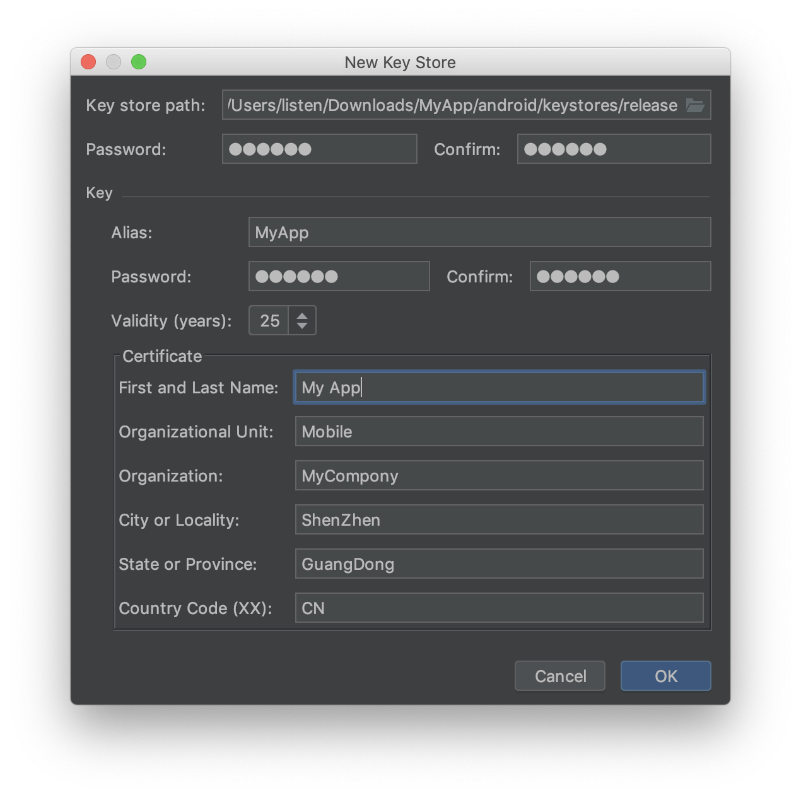
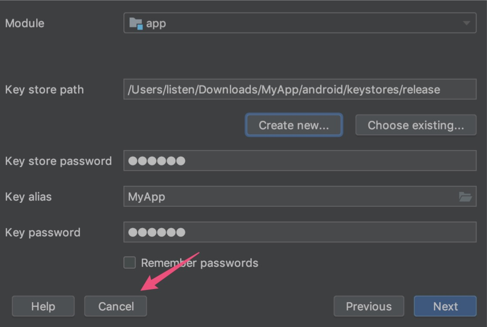

本文讲述 React Native 工程化，Android 工程需要做的准备工作。

本文包括以下内容

- 生成签名密钥
- 混淆配置

## 生成签名密钥

使用 Android Studio 打开我们的 Android 项目，并[生成密钥和密钥库](https://developer.android.com/studio/publish/app-signing#generate-key)

1. 在菜单栏中，点击 **Build > Build > Generate Signed Bundle/APK**

2. 在 **Generate Signed Bundle or APK** 对话框中，选择 APK，然后点击 Next

3. 在 **Key store path** 字段下面，点击 Create new

4. 在 New Key Store 窗口上，为您的密钥库和密钥提供以下信息，如图

Key store path 选择 android/keystores/release

> 生成的密钥请务必备份，且妥善保管，一般情况下，为了安全，不宜放在项目文件夹内，不宜加入到版本控制系统，这是另外一个问题，本文不作展开。



填写完表单后，请点击 OK。

5. 在 **Generate Signed Bundle or APK** 对话框中，点击 Cancel



6. 配置签名文件

```groovy
android {
  signingConfigs {
    config {
      keyAlias 'MyApp'
      keyPassword '123456'
      storeFile file('../keystores/release')
      storePassword '123456'
    }
  }

  buildTypes {
    release {
      minifyEnabled enableProguardInReleaseBuilds
      proguardFiles getDefaultProguardFile("proguard-android.txt"), "proguard-rules.pro"
      signingConfig signingConfigs.config
    }
    debug {
      signingConfig signingConfigs.config
    }
  }
}

```

## 组装 APK

1. 设置应用 Application ID

修改 android/app/build.gradle 文件

设置 applicationId：

```groovy
android {
  defaultConfig {
    applicationId System.getenv("APPLICATION_ID") ?: "com.xxxxxx.mayapp"
  }
}
```

2. 分离不同 CPU 架构的 APK

修改 android/app/build.gradle 文件

```groovy
android {
  splits {
    abi {
      reset()
      enable true
      universalApk true  // If true, also generate a universal APK
      include "arm64-v8a", "armeabi-v7a", "x86_64"
    }
  }
}
```

3. 移除生成 Version Code 的脚本，因为后续我们会通过 CI 变量来处理 version code。

修改 android/app/build.gradle 文件

```diff
- import com.android.build.OutputFile

android{
  defaultConfig {
-    versionCode 1
+    versionCode ((System.getenv("VERSION_CODE") ?: '1').toInteger())
-    versionName "1.0"
+    versionName (System.getenv("VERSION_NAME") ?: '1.0.0')
  }

-   // applicationVariants are e.g. debug, release
-   applicationVariants.all { variant ->
-       variant.outputs.each { output ->
-           // For each separate APK per architecture, set a unique version code as described here:
-           // http://tools.android.com/tech-docs/new-build-system/user-guide/apk-splits
-           def versionCodes = ["armeabi-v7a": 1, "x86": 2, "arm64-v8a": 3, "x86_64": 4]
-           def abi = output.getFilter(OutputFile.ABI)
-           if (abi != null) {  // null for the universal-debug, universal-release variants
-               output.versionCodeOverride =
-                      versionCodes.get(abi) * 1048576 + defaultConfig.versionCode
-           }
-       }
-   }
}
```

最终看起来的效果像这样

```groovy
apply plugin: "com.android.application"

project.ext.react = [
        entryFile: "index.js"
]

apply from: "../../node_modules/react-native/react.gradle"

android {
    compileSdkVersion rootProject.ext.compileSdkVersion

    compileOptions {
        sourceCompatibility JavaVersion.VERSION_1_8
        targetCompatibility JavaVersion.VERSION_1_8
    }

    defaultConfig {
        applicationId System.getenv("APPLICATION_ID") ?: "com.xxxxxx.mayapp"
        minSdkVersion rootProject.ext.minSdkVersion
        targetSdkVersion rootProject.ext.targetSdkVersion
        versionCode ((System.getenv("VERSION_CODE") ?: '1').toInteger())
        versionName (System.getenv("VERSION_NAME") ?: '1.0.0')
    }

    splits {
        abi {
            reset()
            enable true
            universalApk true  // If true, also generate a universal APK
            include "arm64-v8a", "armeabi-v7a", "x86_64"
        }
    }

    signingConfigs {
        config {
            keyAlias 'MyApp'
            keyPassword '123456'
            storeFile file('../keystores/release')
            storePassword '123456'
        }
    }

    buildTypes {
        release {
            // 打生产包时，混淆 java 代码
            minifyEnabled true
            proguardFiles getDefaultProguardFile("proguard-android.txt"), "proguard-rules.pro"
            signingConfig signingConfigs.config
        }
        debug {
            signingConfig signingConfigs.config
        }
    }

    flavorDimensions "default"
    productFlavors {
        qa {

        }
        production {

        }
    }
}

dependencies {
    implementation fileTree(dir: "libs", include: ["*.jar"])
    implementation "com.facebook.react:react-native:+"  // From node_modules
    implementation "androidx.swiperefreshlayout:swiperefreshlayout:1.0.0" // From node_modules
}

// Run this once to be able to run the application with BUCK
// puts all compile dependencies into folder libs for BUCK to use
task copyDownloadableDepsToLibs(type: Copy) {
    from configurations.compile
    into 'libs'
}
```

4. 添加混淆配置

打开 android/app/proguard-rules.pro 文件，添加如下混淆配置

```
-keep,allowobfuscation @interface com.facebook.proguard.annotations.DoNotStrip
-keep,allowobfuscation @interface com.facebook.proguard.annotations.KeepGettersAndSetters

# Do not strip any method/class that is annotated with @DoNotStrip
-keep @com.facebook.proguard.annotations.DoNotStrip class *
-keepclassmembers class * {
    @com.facebook.proguard.annotations.DoNotStrip *;
}

-keepclassmembers @com.facebook.proguard.annotations.KeepGettersAndSetters class * {
  void set*(***);
  *** get*();
}

-keep class * extends com.facebook.react.bridge.JavaScriptModule { *; }
-keep class * extends com.facebook.react.bridge.NativeModule { *; }
-keepclassmembers,includedescriptorclasses class * { native <methods>; }
-keepclassmembers class *  { @com.facebook.react.uimanager.UIProp <fields>; }
-keepclassmembers class *  { @com.facebook.react.uimanager.annotations.ReactProp <methods>; }
-keepclassmembers class *  { @com.facebook.react.uimanager.annotations.ReactPropGroup <methods>; }

-dontwarn com.facebook.react.**
-keep class android.text {* ;}
-dontwarn android.text.*

-keep class com.facebook.react.bridge.CatalystInstanceImpl { *; }
-keep class com.facebook.react.bridge.JavaScriptExecutor { *; }
-keep class com.facebook.react.bridge.queue.NativeRunnable { *; }
-keep class com.facebook.react.bridge.ReadableType { *; }

# okhttp

-keepattributes Signature
-keepattributes *Annotation*
-keep class com.squareup.okhttp.** { *; }
-keep interface com.squareup.okhttp.** { *; }
-dontwarn com.squareup.okhttp.**

# okio

-keep class sun.misc.Unsafe { *; }
-dontwarn java.nio.file.*
-dontwarn org.codehaus.mojo.animal_sniffer.IgnoreJRERequirement
-dontwarn okio.**

# stetho

-dontwarn com.facebook.stetho.**

# sentry
-keepattributes LineNumberTable,SourceFile
-dontwarn org.slf4j.**
-dontwarn javax.**
-keep class io.sentry.event.Event { *; }
```

5. 尝试构建

cd 到 android 文件夹，执行如下命令，尝试构建 production 环境的包

```
cd android
./gradlew assembleProductionRelease
```

构建成功后，可以在 anroid/app/build/outputs/apk/production/release 下，看到两个 APK 包，一个可以安装在真机上，一个可以安装在模拟器上。

使用 `adb install` 命令安装即可
