通常，App 开发、部署会涉及多个环境，譬如开发、测试、预发布、生产等环境。为了避免打错包，我们需要使用科学的方法来切换环境。

## 使用 Configuration 和 Scheme 来实现 iOS 工程的多环境配置

按照下图指引，分别 Duplicate "Debug" Configuration 和 Duplicate "Release" Configuration，创建 Debug production 和 Release production 两个 configuration。

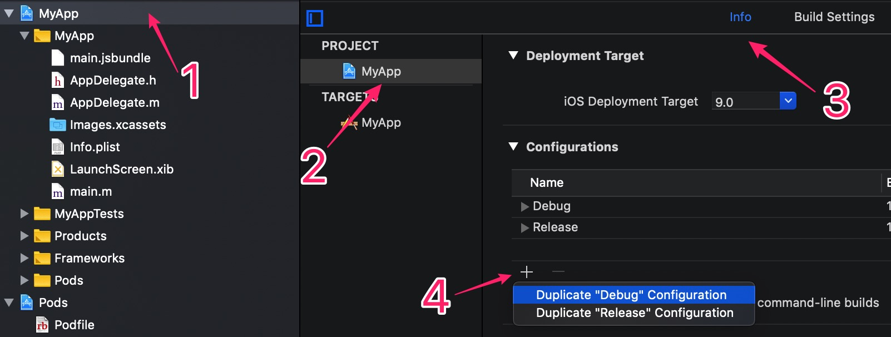

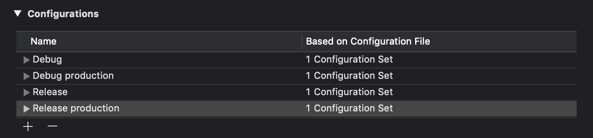

### 创建环境变量

如下图所示，点击 **+** 按钮，添加用户定义设置


我们添加 BUILD_TYPE 和 ENVIRONMENT 这两个自定义设置，结果如图所示：

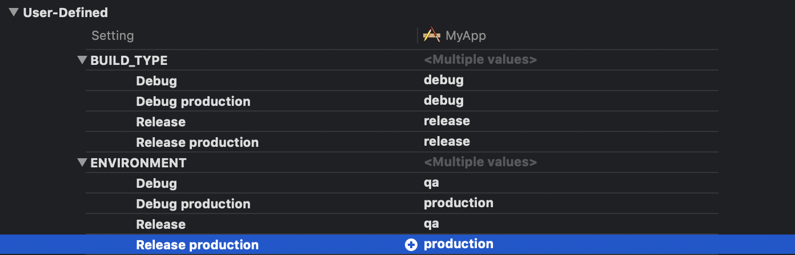

打开 Info 选项卡

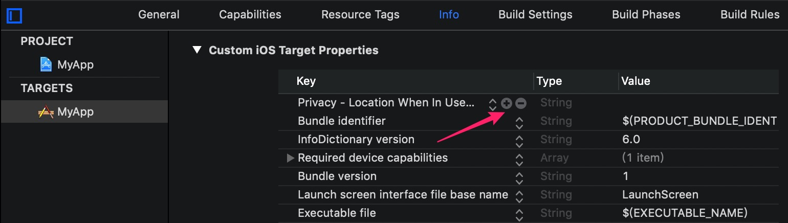

添加一个名为 AppSettings 的字典，它有两个字段：BUILD_TYPE 和 ENVIRONMENT，它们的值分别为 $(BUILD_TYPE) 和 $(ENVIRONMENT)

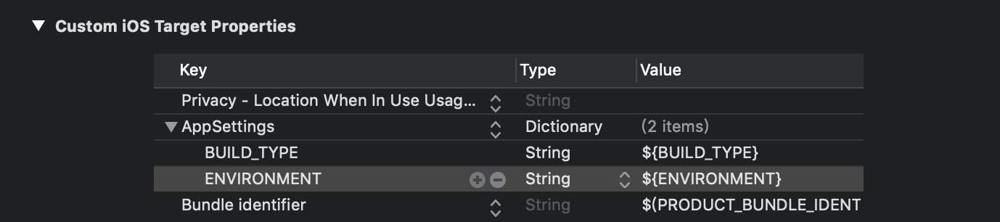

点击 **Scheme** 按钮，创建新的 scheme，命名为 **MyApp qa**，中间有个空格，这个 scheme 纯粹是对 MyApp 的复制

点击 **Scheme** 按钮，创建新的 scheme，命名为 **MyApp production**，中间有个空格。

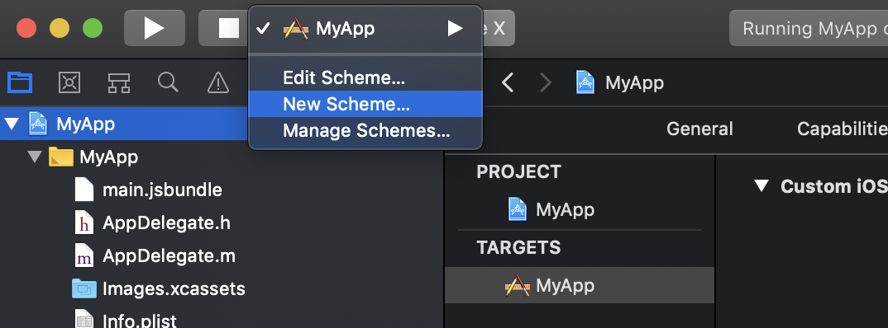

编辑 MyApp production， 把左边 **Run Test Profile Analyze Archiv** 每个选项卡中的 **Build Configuration** 设置为对应的 production 版本。

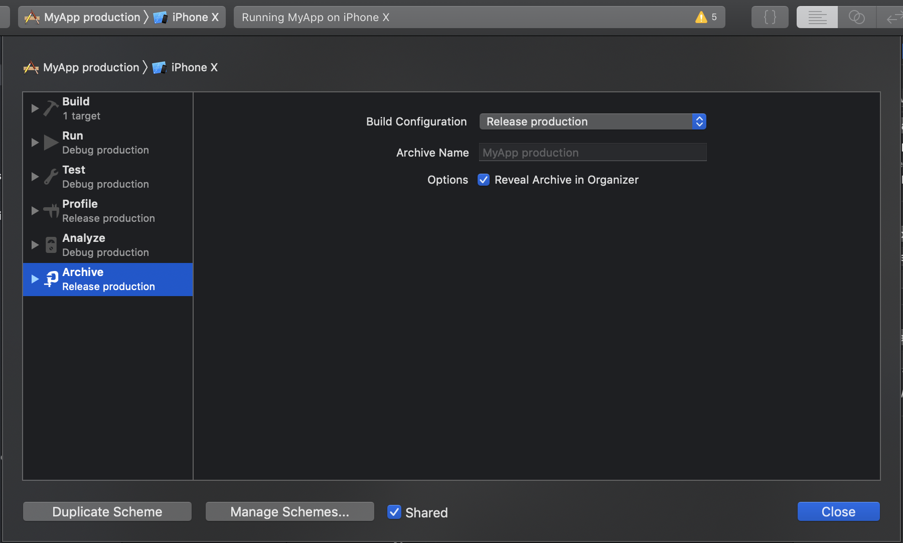

### 创建原生模块

现在，我们通过切换 scheme，就能切换 BUILD_TYPE 和 ENVIRONMENT 这些变量的值。为了让 RN 能够知道这些值，我们需要借助[原生模块](http://facebook.github.io/react-native/docs/native-modules-ios)。

选中 MyApp 目录，右键打开菜单，选择 **New File...**

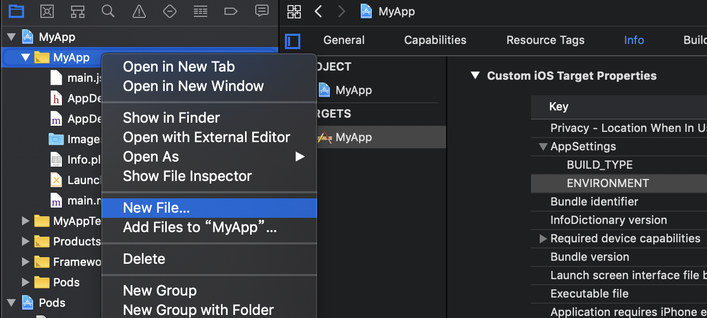

在弹出的界面中，确定 **Cocoa Touch Classs** 处于选中状态，点击 **Nex**

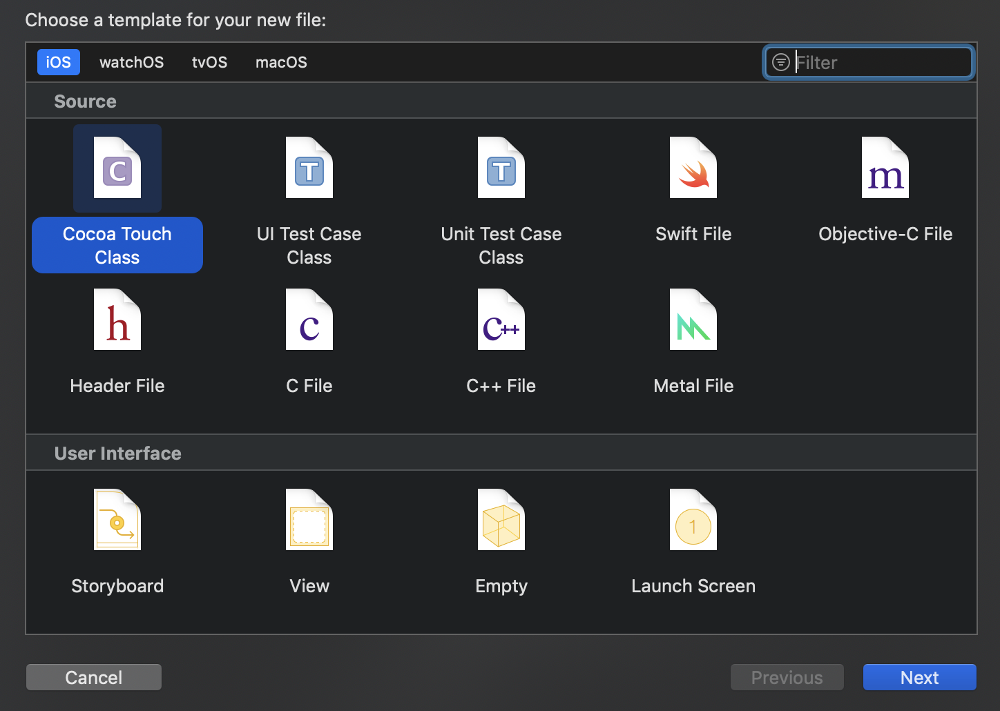

创建一个名为 AppIno(名字随意) 的类，然后 **Next**

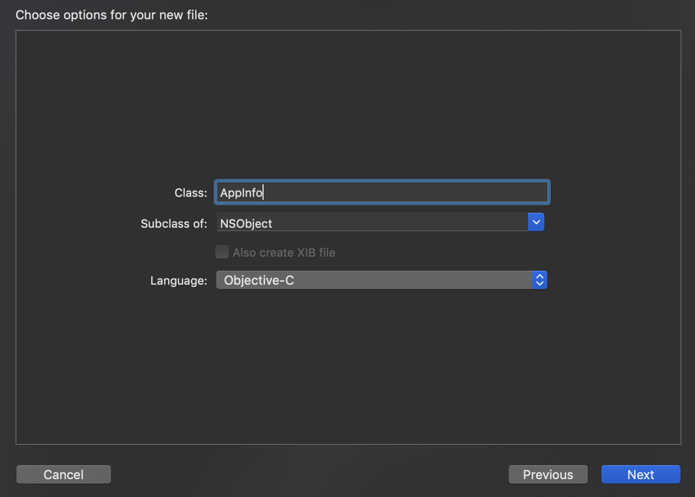

选择类文件要存放的目录，在这个示例工程里，我们把它放在 MyApp 目录下

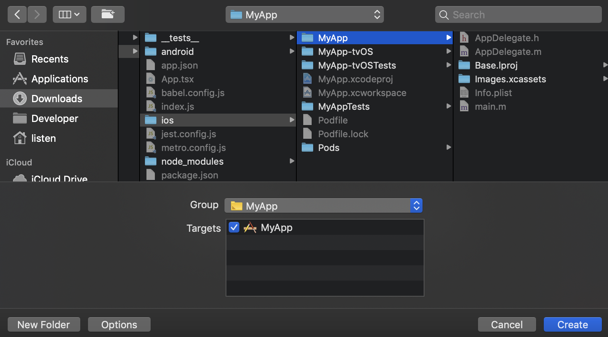

点击 **Create** 完成创建

### 编辑原生模块

编辑 AppInfo.h 文件

```objc
#import <React/RCTBridge.h>

NS_ASSUME_NONNULL_BEGIN

@interface AppInfo : NSObject <RCTBridgeModule>

@end

NS_ASSUME_NONNULL_END
```

编辑 AppInfo.m 文件

```objc
#import "AppInfo.h"

@implementation AppInfo

RCT_EXPORT_MODULE(AppInfo)

+ (BOOL)requiresMainQueueSetup {
  return YES;
}

- (dispatch_queue_t)methodQueue {
  return dispatch_get_main_queue();
}

- (NSDictionary *)constantsToExport {
  NSDictionary *info = [[NSBundle mainBundle] infoDictionary];
  NSMutableDictionary *settings = [[info objectForKey:@"AppSettings"] mutableCopy];
  NSString *versionName = [info objectForKey:@"CFBundleShortVersionString"];
  NSNumber *versionCode = [info objectForKey:@"CFBundleVersion"];
  NSString *bundleId = [info objectForKey:@"CFBundleIdentifier"];
  [settings setObject:versionName forKey:@"VERSION_NAME"];
  [settings setObject:versionCode forKey:@"VERSION_CODE"];
  [settings setObject:bundleId forKey:@"APPLICATION_ID"];
  return settings;
}

@end
```

在上面这个原生模块中，我们导出了 `BUILD_TYPE` `ENVIRONMENT` `VERSION_NAME` `VERSION_CODE` `APPLICATION_ID` 等变量，这些变量，我们稍后可以在 RN 模块中读取。

## 使用 flavor 来实现 Android 工程的多环境配置

### 添加 flavor

编辑 android/app/build.gradle 文件，添加 flavor

```groovy
android{
    flavorDimensions "default"
    productFlavors {
        qa {

        }
        production {

        }
    }
}
```

就这样，我们创建了 qa 和 production 两个环境，我们通过[原生模块](http://facebook.github.io/react-native/docs/native-modules-android)将相关环境变量导出。

### 创建原生模块

打开 AndroidStudio，如图所示，创建一个名为 AppInfo 的 java 文件

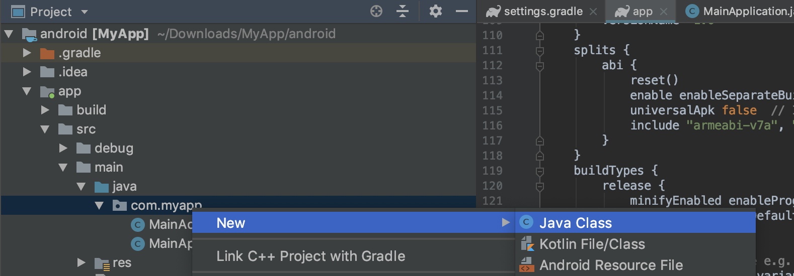

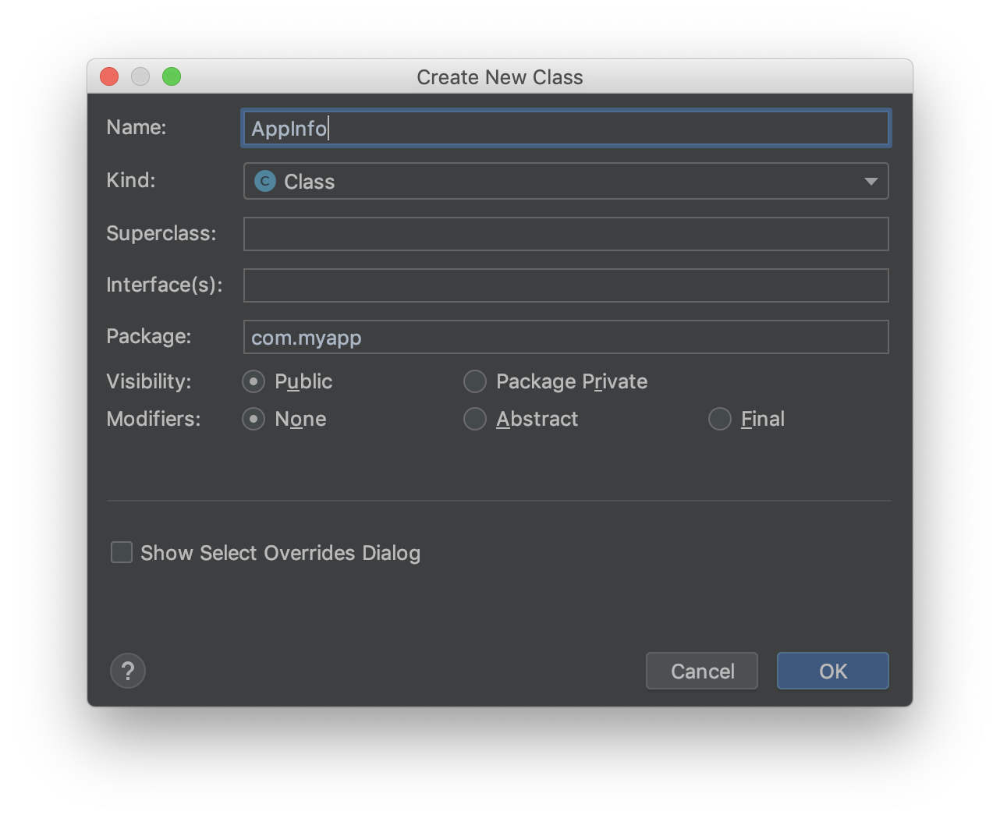

编辑该文件

```java
package com.myapp;

import com.facebook.react.bridge.ReactApplicationContext;
import com.facebook.react.bridge.ReactContextBaseJavaModule;

import java.util.HashMap;
import java.util.Map;

import javax.annotation.Nonnull;
import javax.annotation.Nullable;

public class AppInfo extends ReactContextBaseJavaModule {

    public AppInfo(@Nonnull ReactApplicationContext reactContext) {
        super(reactContext);
    }

    @Nonnull
    @Override
    public String getName() {
        return "AppInfo";
    }

    @Nullable
    @Override
    public Map<String, Object> getConstants() {
        HashMap<String, Object> constants = new HashMap<>();
        constants.put("ENVIRONMENT", BuildConfig.FLAVOR);
        constants.put("VERSION_NAME", BuildConfig.VERSION_NAME);
        constants.put("VERSION_CODE", BuildConfig.VERSION_CODE);
        constants.put("APPLICATION_ID", BuildConfig.APPLICATION_ID);
        constants.put("BUILD_TYPE", BuildConfig.BUILD_TYPE);
        return constants;
    }
}
```

在上面的文件中，我们通过名为 AppInfo 的模块，导出了 `BUILD_TYPE` `ENVIRONMENT` `VERSION_NAME` `VERSION_CODE` `APPLICATION_ID` 等变量。

如图，创建一个叫 AppPackage 的文件

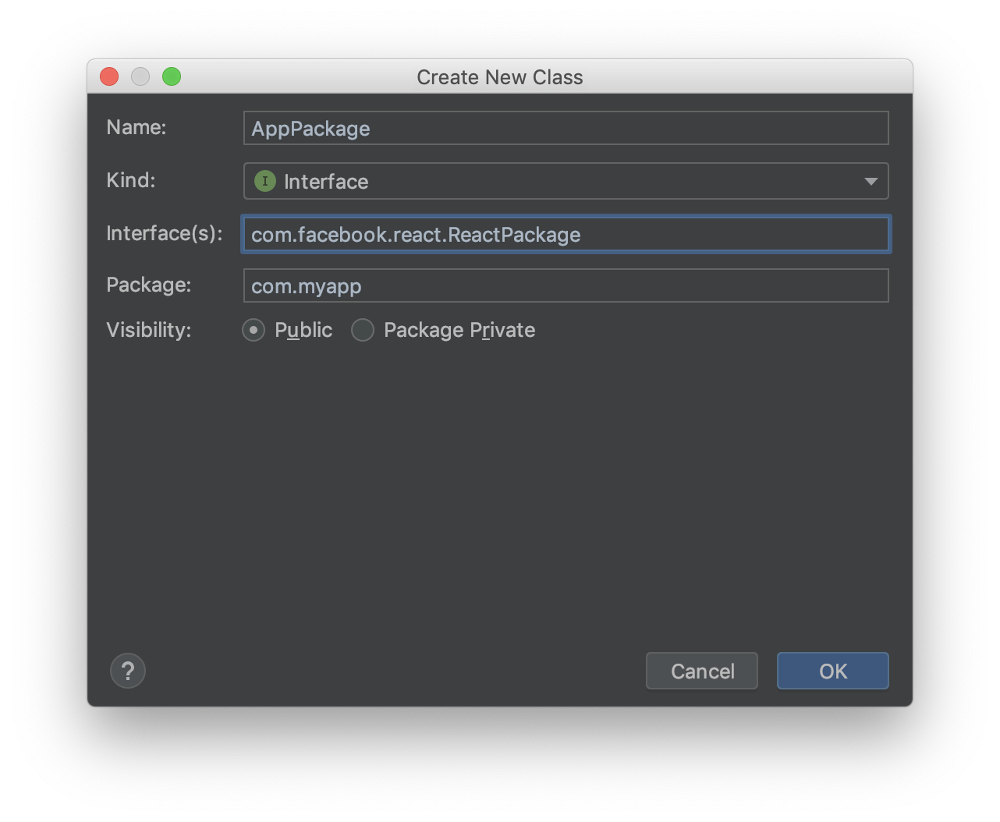

编辑如下：

```java
package com.myapp;

import com.facebook.react.ReactPackage;
import com.facebook.react.bridge.NativeModule;
import com.facebook.react.bridge.ReactApplicationContext;
import com.facebook.react.uimanager.ViewManager;

import java.util.ArrayList;
import java.util.Collections;
import java.util.List;

import javax.annotation.Nonnull;

public class AppPackage implements ReactPackage {
    @Nonnull
    @Override
    public List<NativeModule> createNativeModules(@Nonnull ReactApplicationContext reactContext) {
        List<NativeModule> modules = new ArrayList<>();
        modules.add(new AppInfo(reactContext));
        return modules;
    }

    @Nonnull
    @Override
    public List<ViewManager> createViewManagers(@Nonnull ReactApplicationContext reactContext) {
        return Collections.emptyList();
    }
}
```

修改 MainApplication.java 文件

```java
package com.myapp;

import android.app.Application;

import com.facebook.react.ReactApplication;
import com.facebook.react.ReactNativeHost;
import com.facebook.react.ReactPackage;
import com.facebook.react.shell.MainReactPackage;
import com.facebook.soloader.SoLoader;

import java.util.Arrays;
import java.util.List;

public class MainApplication extends Application implements ReactApplication {

    private final ReactNativeHost mReactNativeHost = new ReactNativeHost(this) {
        @Override
        public boolean getUseDeveloperSupport() {
            return BuildConfig.DEBUG;
        }

        @Override
        protected List<ReactPackage> getPackages() {
            return Arrays.<ReactPackage>asList(
                    new MainReactPackage(),
                    // 添加本项目需要导出的 package
                    new AppPackage()
            );
        }

        @Override
        protected String getJSMainModuleName() {
            return "index";
        }
    };

    @Override
    public ReactNativeHost getReactNativeHost() {
        return mReactNativeHost;
    }

    @Override
    public void onCreate() {
        super.onCreate();
        SoLoader.init(this, /* native exopackage */ false);
    }
}
```

到目前为止，我们就已经创建了原生模块，并导出了相关变量。

## 在 React Native 代码中读取原生代码导出的环境变量

在项目根目录下创建名为 app 的文件夹，在里面创建名为 AppInfo.ts 的文件，编辑如下

```ts
// AppInfo.ts
import { NativeModules } from 'react-native'
const AppInfo = NativeModules.AppInfo

export const ENVIRONMENT: string = AppInfo.ENVIRONMENT
export const VERSION_NAME: string = AppInfo.VERSION_NAME
export const VERSION_CODE: number = AppInfo.VERSION_CODE
export const APPLICATION_ID: string = AppInfo.APPLICATION_ID

export const BUILD_TYPE_DEBUG = 'debug'
export const BUILD_TYPE_RELEASE = 'release'
export type BUILD_TYPE_DEBUG = typeof BUILD_TYPE_DEBUG
export type BUILD_TYPE_RELEASE = typeof BUILD_TYPE_RELEASE
export const BUILD_TYPE: BUILD_TYPE_DEBUG | BUILD_TYPE_RELEASE = AppInfo.BUILD_TYPE
```

就这样，我们读取到了原生模块导出的变量，可以在有需要的地方使用这些变量

## 如何切换环境

现在，我们有了 qa 和 production 两个环境，那么如何切换环境呢？

iOS 在点击 Run 按钮之前，选择对应环境的 scheme 即可，譬如选择 MyApp qa 就是选择了 qa 环境。

Android 则通过 `./gradlew assembleQaRelease` 和 `./gradlew assembleProductionRelease` 分别可以打 qa 和 production 环境的包。

不同环境还可以配置不同的 App icon 和 App name，有兴趣的同学可以去研究下。

切换环境如此容易，还担心打错包吗？
