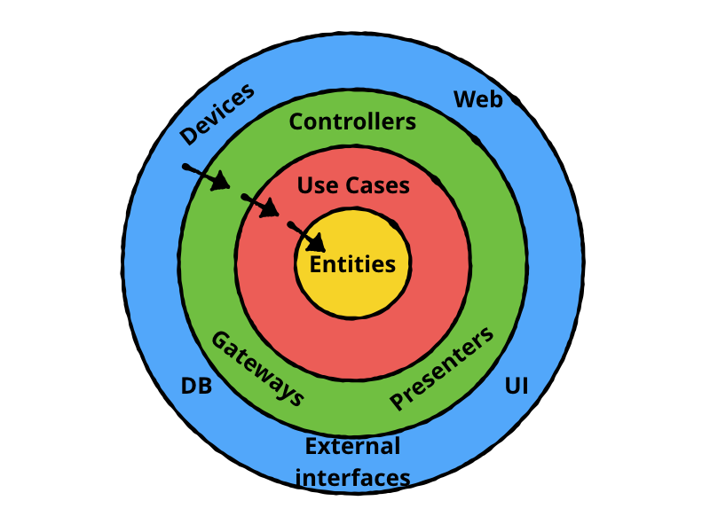

我们的 App 遵循[整洁架构](https://blog.cleancoder.com/uncle-bob/2012/08/13/the-clean-architecture.html)。

整洁架构是 Uncle Bob 的心血结晶，他是《代码整洁之道》的作者。这种架构的要义是，业务逻辑（也称为 Domain），是应用的核心。

## 依赖规则

在整洁架构的世界里，我们将不同职责的类，分派到不同的圈层中。

**外层应当依赖内层。**

外层看见，知道，了解内层，但内层看不见，也不知道，更不了解外层。



内层是业务层，与 UI 无关，与设备无关，它们不依赖任何 React 以及 React Native 的东西，它们不知道自己运行在哪个环境中，即使将它们的代码原封不动地拷贝到一个小程序项目中，只要外层实现了内层的接口，代码就能正常运转。

UI 在外层，数据也在外层，UI 需要展示数据，但 UI 层和数据层不能彼此依赖，它们都依赖业务层，那数据是如何流向 UI 的呢？

答案是[**控制反转**](https://zh.wikipedia.org/wiki/%E6%8E%A7%E5%88%B6%E5%8F%8D%E8%BD%AC)。

业务层声明自己所依赖的数据接口，数据层实现这些接口，我们通过依赖注入，向业务层注入数据接口的实现。

## 业务层

我们遵循高内聚，低耦合的原则，把相关的 UseCase 都聚合到同一个 Service 中，不同的 Service 管理着各自的领域。

譬如 `AuthService` 管理着和身份认证相关的用例，包含登入、登出、刷新 token、第三方登录等逻辑。

业务层是整个应用的核心，UI 层和数据层都依赖它。

如果业务层的业务状态发生变化，如何通知 UI 层呢？

我们通过**订阅 / 发布**模式来实现这点。

一个事件只能由同一个 Service 发布，确保单一事件源。

## 数据层

我们通过 [Repository Pattern](https://blog.kylegalbraith.com/2018/03/06/getting-familiar-with-the-awesome-repository-pattern/) 屏蔽数据的来源，使用者不需要关心数据是来源于网络还是缓存。

Repository 需要遵循[单一可信来源](https://developer.android.com/jetpack/docs/guide?hl=zh-cn#truth)原则。

我们在内层定义 Repository 接口，Service 依赖这些接口。

我们在外层实现这些 Repository 接口，最后通过**依赖注入**的方式，为 Service 提供 Repository 的具体实现。

但是 Service 对 Repository 的实现一无所知，因为它依赖的是接口。

数据层从后台或本地存储中获取到的数据，通常是 json，或者 key-value。这些数据不能直接传递给服务层，需要转换成服务层所使用的数据结构。

## 设备

设备位于最外层。

假如我们的应用需要定位功能，按照整洁架构的依赖原则，我们的设备依赖我们的业务层。

## MVC, MVP, MVVM

MVC, MVP, MVVM 都是表现层的架构。

Controller, Presenter, ViewModel 是连接业务层和 UI 的桥梁，它们负责处理 UI 状态逻辑。

[React Hook](https://react.docschina.org/docs/hooks-intro.html) 承担了表现层部分状态逻辑。

UI 层从服务层所获得的数据，有时候，或大多数情况下，并不能直接作为界面的状态展示出来，需要先进行适配。这也是为什么绿色那层也被称为接口适配层的原因。譬如，我们从服务层拿到的表示时间的数据，可能是一个整型的时间戳，需要先适配成描述性的字符串后展示出来。

有时，一个 UI 界面所依赖的数据来自于多个 Service，我们需要把这多个数据源聚合在一起，转换(适配)成 UI 可以展示的数据结构。譬如一个用户头像组件，它的头像数据来源于 UserService，然而头像的角落有个 Badge 来表示未读的消息数目，这个数据则来源于 ChatService，我们需要组合这些数据，构造一个叫 `AvatarItem` 的数据结构，传递给 `AvatarComponent`。

```ts
interface AvatarItem {
  url: string
  unread: number
}
```

UI 层的数据转换逻辑放在哪呢？如果采用了 MVP 或者 MVVM 模式，就放在 Presenter 或 ViewModel 中，否则就放在和 UI Component 相同的文件中，可以是一个工具函数，也可以是一个方法。工具函数如果需要多处复用，则抽取到 helper 文件中。

## Socket

(Web)Socket 和设备一样，位于最外层。

当服务器通过 Socket 给 App 发送信息时，相当于用户操作了界面。此时，处理该消息的 Handler 就是控制器，它们依赖 Service，调用 Service 提供的方法操作数据。

当 Service 需要通过 Socket 给服务器发送消息时，Socket 就相当于 Repository，此时，应当遵循 Repository 模式。Service 依赖 Repository 接口，而 Socket 层则实现这一接口。

## 异常处理

我们在业务层定义了若干常见异常（Error）。

所有的网络访问 Error，都应当转译成业务 Error，因为业务层不依赖网络层，更不能把网络异常传递给 UI 层。

转译后的 Error 应当包含原始的 Error

```ts
class WrappedError extends Error {
  cause: Error | null
  constructor(cause: Error | null, message?: string) {
    super(message)
    this.cause = cause
  }
}

export class AuthError extends WrappedError {
  constructor(cause: Error | null, message: string = '手机号码或验证码错误') {
    super(cause, message)
    this.name = 'AuthError'
  }
}
```

业务层通常不捕获异常。

UI 层则应当捕获业务层抛出的 Error，提示用户操作失败，或提供重试机会。

UI 层在处理异常时，可以使用 Result Pattern，我们提供了一个辅助方法来帮助使用该模式

```ts
export async function result<T, U = Error>(promise: Promise<T>): Promise<[U | null, T | null]> {
  try {
    const data = await promise
    return [null, data]
  } catch (err) {
    return [err, null]
  }
}
```

但是，不能强迫客户代码使用该模式。也就是说，只应该在方法内部处理异常时使用 Result Pattern，不能将该模式用于方法的返回值中，而是应该抛出异常。
