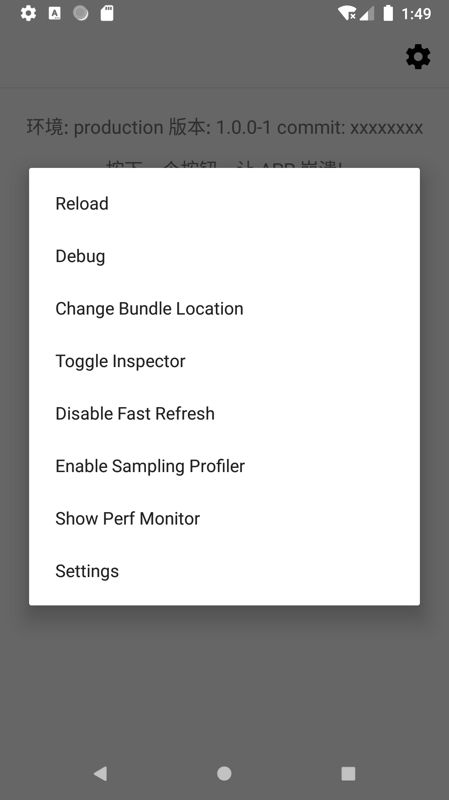

## 运行

克隆代码

```sh
git clone git@github.com:listenzz/MyApp.git
```

安装 NPM 包

```sh
yarn install
```

NPM 包安装完成后，通过以下命令启动 Package Server

```sh
npm start
```

### 运行 Android 项目

使用数据线连接测试设备，输入以下命令：

```
abd reverse tcp:8081 tcp:8081
```

> 注意设备要打开开发者模式

我们可以通过 Android Studio 或命令行的方式来运行 Android 项目

#### 通过 Android Studio 来运行

在 Android Studio 左下角，找到并打开 Build Variants 选项卡，将 app module 的 Active Build Variant 切换至期待的环境（譬如 qaDebug）。

点击 Android Studio 上的运行按钮，即可安装和启动 App。

#### 通过命令行来运行

启动终端，输入以下命令，即可在 qa 环境下运行

```sh
npm run android
```

如果想要在生产环境下运行，输入以下命令

```sh
npx react-native run-android --variant productionDebug
```

### 运行 iOS 项目

使用数据线连接 iOS 设备，确保手机和电脑在同一个网络下。

> 如果电脑的 wifi 和以太网不是同一个网络，把网线拔了吧

将工作目录切换到 ios

```sh
cd ios
```

我们使用 [Bundler](https://bundler.io/) 来确保无论项目在哪台机器上运行，所依赖的 [Fastlane](https://fastlane.tools/) 和 [Cocoapods](https://cocoapods.org/) 版本都是一致的。

安装 Fastlane 和 Cocoapods 等依赖

```sh
bundle install
```

Cocoapods 是 iOS 项目的依赖管理器，如同 npm 之于 Node。

运行以下命令，安装依赖

```sh
bundle exec pod install
```

> 每当 iOS 项目依赖有更新时，需要再次运行 `bundle exec pod install`

iOS 项目在真机上运行，需要证书

首先[注册一个 Apple ID](https://support.apple.com/zh-cn/HT204316)，也可以使用现有的 Apple ID，省去注册的麻烦。

将 Apple ID 提供给项目管理者，他会将你的 Apple ID 加入到苹果开发者账号，并授予合适的权限，留意你收到的邮件。

如果你所使用的 iOS 设备还没有注册到苹果开发者账号，那么按照以下步骤获得 UDID，交由项目管理者注册到苹果开发者账号，才能运行和调试项目。


确认管理者已经将你的 Apple ID 加入到苹果开发者账号，并将新的设备注册到苹果开发者账号后，运行以下命令，安装证书

```sh
bundle exec fastlane match development
```

> 每当 iOS 开发者证书有更新时，需要再次运行 `bundle exec fastlane match development`

如果你对上面这一切有疑问，请参考我们的 [React Native 工程实践](https://github.com/listenzz/MyApp)。

我们同样可以通过 Xcode 或命令行的方式来运行 iOS 项目

#### 通过 Xcode 来运行

在 Xcode 左上角，点击 Scheme 按钮，选择期待环境的 Scheme，譬如 **MyApp qa**。

点击 Xcode 的运行按钮，即可在 qa 环境下启动 iOS 应用。

#### 通过命令行来运行

首先安装 ios-deploy

```sh
npm install -g ios-deploy
```

然后运行以下命令，即可在 qa 环境下运行

```sh
npx react-native run-ios --scheme 'MyApp qa' --configuration 'Debug qa' --device '你的 iPhone 名称'
```

### 创建新项目

有时，我们需要创建新的 React Native 项目

可以使用 `npx react-native init` 的方式来创建

不过我们推荐使用 [react-native-create-app](https://github.com/listenzz/react-native-create-app) 来创建。

无论采用那种方式来创建，请参考我们的 [React Native 工程实践](https://github.com/listenzz/MyApp)。

## 调试

应用运行起来后，便可调试

当运行 `npm start` 后，可以看到有这样的提示

```
To reload the app press "r"
To open developer menu press "d"
```

在运行 `npm start` 的终端，输入 **d** 即可打开开发菜单



点击开发菜单上的 **Debug** 选项，打开 Google Chrome，根据提示，同时按下 **⌘ + ⌥ + I**，打开 Chrome 开发工具。

如果想要调试原生代码，请使用 Xcode 或 Android Studio 运行项目

### GraphQL

我们的 API 有两种风格，分别是 RESTful 和 GraphQL。

阅读以下资料，理解两种 API 风格。

[RESTful API 设计指南](http://www.ruanyifeng.com/blog/2014/05/restful_api.html)

[GraphQL](https://graphql.cn/)，一种用于 API 的查询语言。

安装 GraphiQL，便于调试 GraphQL 接口

```sh
brew cask install graphiql
```

输入 Endpoint，和通过 HTTP headers 设置 access token，便可愉快地探索我们的 GraphQL 接口


