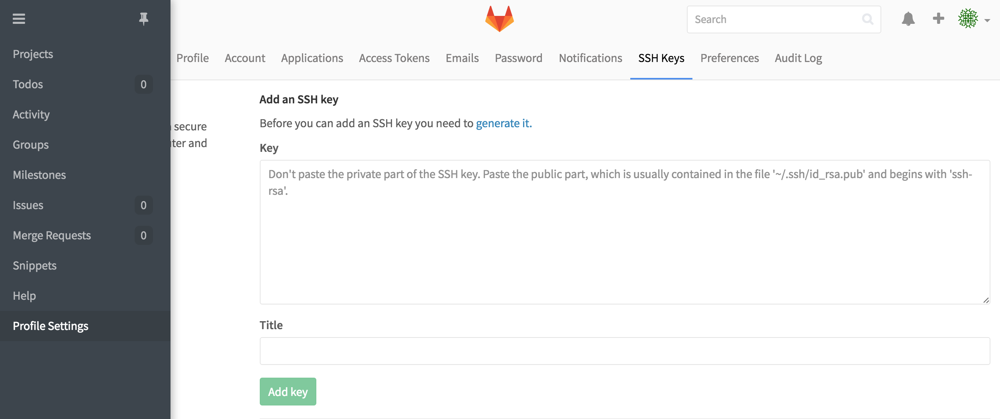
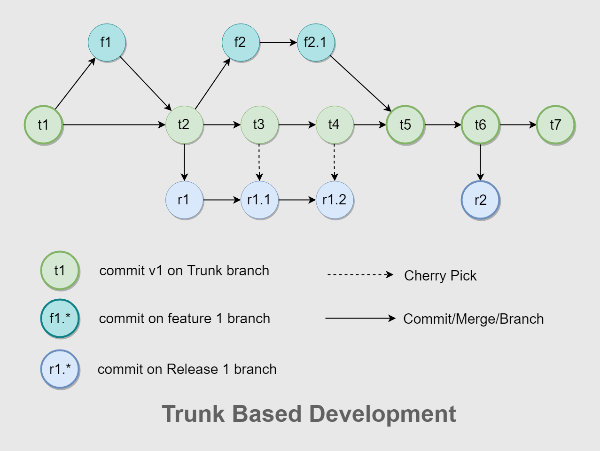
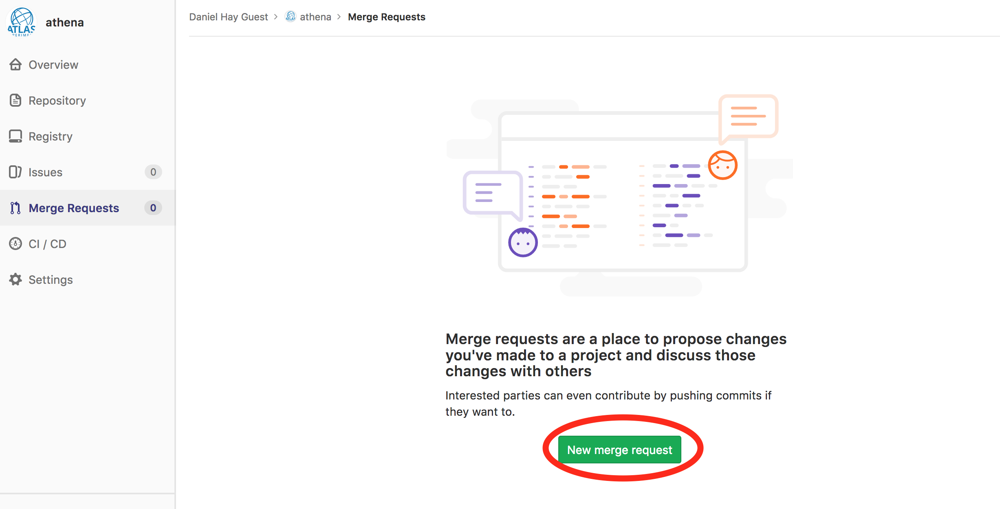
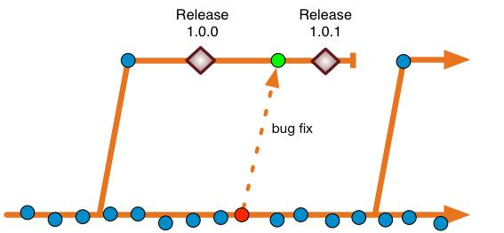

本文讲述我们在使用 Git 作为版本控制工具方面的实践。

### 配置 SSH KEY

本文基于使用私有部署的 GitLab 来作为代码仓库，为了可以免密拉取和提交代码，需要配置 SSH key。

1. 查看是否已有 SSH key 存在

打开终端，输入 `ls -al ~/.ssh`

```sh
$ ls -al ~/.ssh
# Lists the files in your .ssh directory, if they exist
```

如果存在，跳到 3 步，否则，跳到第 2 步

2. 生成 SSH Key

打开终端，复制以下命令，记得替换邮箱地址

```sh
ssh-keygen -t rsa -b 4096 -C "your_email@example.com"
```

一路回车即可，不要设置密码

3. 添加你的 SSH key 到 ssh-agent

在后台启动 ssh-agent

```sh
$ eval "$(ssh-agent -s)"
> Agent pid 59566
```

检查 `~/.ssh/config` 是否存在

```sh
$ open ~/.ssh/config
> The file /Users/you/.ssh/config does not exist.
```

如果不存在就创建

```
$ touch ~/.ssh/config
```

打开 `~/.ssh/config`，修改成如下样子

```
Host *
  AddKeysToAgent yes
  UseKeychain yes
  IdentityFile ~/.ssh/id_rsa
```

将 SSH 私钥添加到 ssh-agent

```sh
$ ssh-add -K ~/.ssh/id_rsa
```

4. 复制 SSH Key 到 GitLab

运行以下命令，复制 SSH Key 到剪贴板

```sh
$ pbcopy < ~/.ssh/id_rsa.pub
# Copies the contents of the id_rsa.pub file to your clipboard
```

打开 GitLab -> Profile Settings -> SSH Keys
右键粘贴或者 Command + V，把刚刚拷贝的 SSH Key 添加到 Key 文本域里面，注意不要有新行或空格，随意起一个 title，点击 Add key 按钮确认添加。



5. 测试 SSH 连接

通过以下命令测试 SSH 连接，记得将 gitlab.com 替换成私有部署的 GitLab 域名。

```
ssh -T git@gitlab.com
```

如果连接成功，会看到下面这样的信息

```
Welcome to GitLab, @listen!
```

参考资料：

[Connecting to GitHub with SSH](https://help.github.com/en/github/authenticating-to-github/connecting-to-github-with-ssh)

### 掌握 Git 基本知识


常用命令：

```sh
# 从远程主机克隆仓库到本地
git clone [url]
```

```sh
# 新建一个分支，并切换到该分支
git checkout -b feature/login
```

```sh
# 显示本地仓库状态
git status
```

```sh
# 添加当前目录的所有文件到暂存区
git add .
```

```sh
# 提交暂存区到仓库区
git commit -m [message]
```

```sh
# 修改上一次提交
git commit --amend -m [message]
```

```sh
# 用 rebase 模式合并代码
git pull --rebase origin master:feature/login
```

```sh
# 解决冲突后，继续 rebase
git rebase --continue
```

```sh
# 上传本地指定分支到远程仓库，并建立追踪关系
git push -u origin feature/login
```

```sh
# 强行推送当前分支到远程仓库对应分支，即使有冲突
git push --force
```

```sh
# 停止追踪指定文件，但该文件会保留在工作区
git rm --cached [file]
```

```sh
# 改名文件，并且将这个改名放入暂存区
git mv [file-original] [file-renamed]
```

请务必理解 [merge 和 rebase 的区别](https://www.atlassian.com/git/tutorials/merging-vs-rebasing)

如果遇到意外，可使用 `git reflog` 和 `git reset --hard` 来救命。

参考资料：

[常用 Git 命令清单](http://www.ruanyifeng.com/blog/2015/12/git-cheat-sheet.html)

[Git 远程操作详解](http://www.ruanyifeng.com/blog/2014/06/git_remote.html?utm_source=tuicool&utm_medium=referral)

[如何撰写 Git 提交信息](https://jiongks.name/blog/git-commit/)

推荐使用 [Sourcetree](https://www.sourcetreeapp.com/) 可视化管理 Git 仓库，专注于编码。

```sh
brew cask install sroucetree
```

### 理解 Git 分支管理模型

阅读[基于 Git 的分支管理模型](https://yasinshaw.com/articles/51)，理解什么是 `Git Flow` `GitHub Flow` `Trunk Based Development`。

我们使用的分支管理模型主要基于 `Trunk Based Development`



master 分支是我们的持续集成分支，是个受保护的分支，不允许直接 push 代码。

也就是说，以下命令将会失效

```sh
git push origin master
```

#### 日常开发流程

1. 当有新的需求时，从 master 分支 checkout 一个 feature 分支

分支可以以功能名称命名或以开发者的名字命名，如 feature/login

```sh
# 创建新的 feature 分支
git checkout -b feature/login
```

2. 定期从 feature 分支 rebase 到 master 分支

```sh
git pull --rebase origin master:feature/login
```

如果有冲突，解决冲突，继续 rebase

```
git rebase --continue
```

> 不要等到自己负责的功能完成后才将代码 rebase 到 master 分支，要养成及时更新代码的习惯。这样可以避免许多冲突。

3. 功能开发完成后，推送 feature 分支到远程仓库

```
git push -u origin
```

4. 创建 Merge Request，请求合并 feature 分支到 master 分支



创建 Merge Request 后，只要代码还没有合并，都可以持续提交代码，甚至强制提交。

```sh
git push --force
```

代码通过 review 合并后， feature 分支通常会被删除，可使用以下命令清理本地仓库，以免堆积过多无用分支。

```sh
git fetch origin && git remote prune
```

#### release

需要发版时，由管理者创建 release 分支，并打上 tag 作为版本号，发布新的版本。

如果线上版本有 BUG，通常在 master 分支进行修复，然后由管理者 cherry-pick 到对应的 release 分支，打上新的 tag 作为版本号，发布新的版本。


