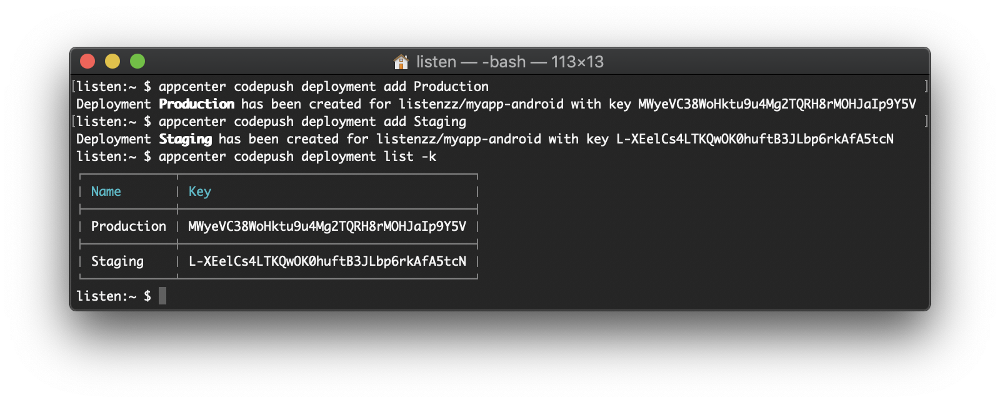
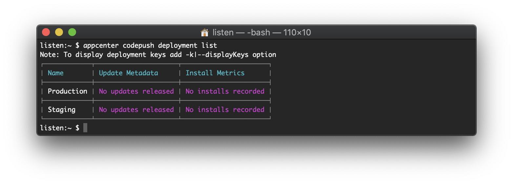
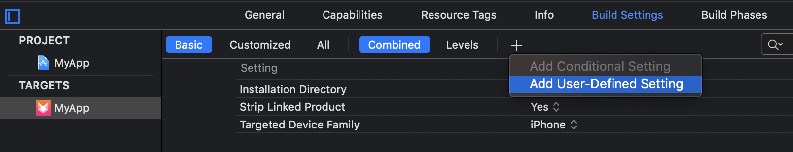
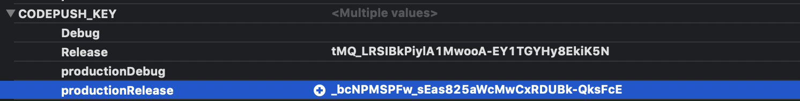
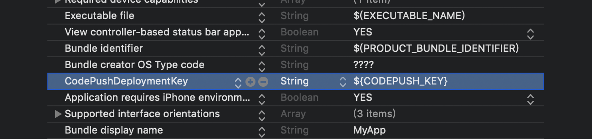
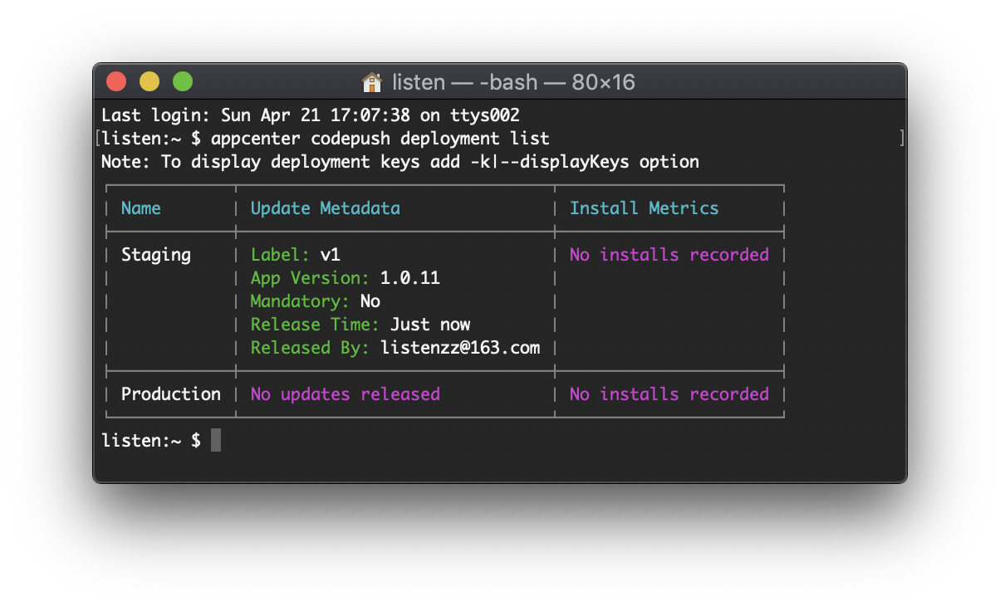
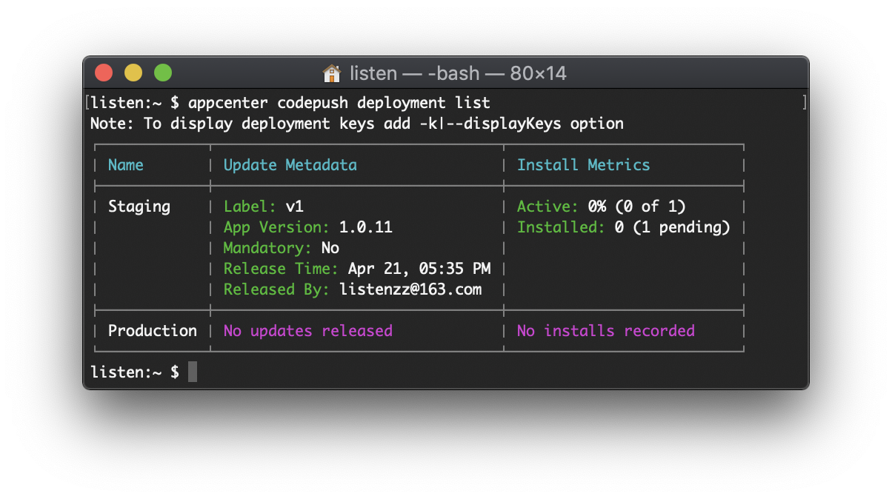
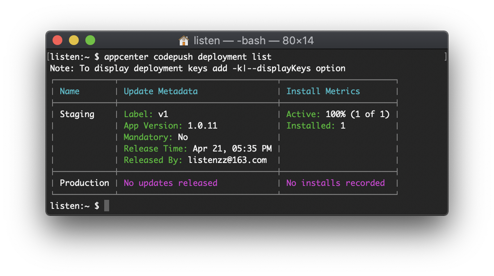
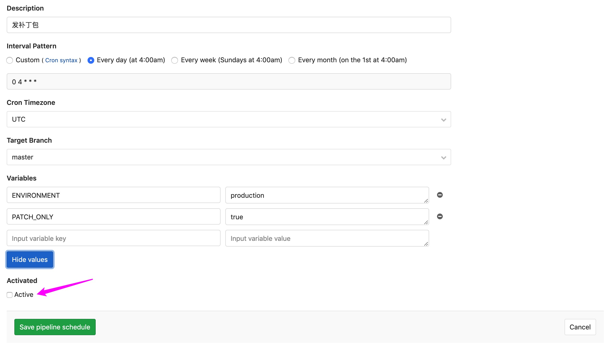

# 集成热更新（CodePush）

使用 React Native 开发 App 不仅可以使用前端技术栈，而且可以通过热更新快速修复 BUG，让用户能及时体验产品新的特性。

本文介绍如何通过 **CI / CD** 发布热更新，并把符号表上传到 [Sentry](https://sentry.io/welcome/)，方便监控补丁包可能产生的崩溃问题。

## 注册热更新服务

我们使用微软提供的热更新服务 [react-native-code-push](https://github.com/Microsoft/react-native-code-push)。

这个服务有个配套的命令行应用 code-push-cli，但我们需要配合 Sentry 使用，这里采用的是微软的另外一个命令行应用 [appcenter-cli](https://github.com/Microsoft/appcenter-cli)。

安装 appcenter-cli

```
npm i -g appcenter-cli
```

安装成功后，查看有哪些命令可用

```
appcenter -h
```

提示：可以使用 -h 参数查看任意子命令的帮助信息，如：

```
appcenter login -h
appcenter apps create -h
```

现在，让我们先注册一个账号，在弹出的网页中，建议使用 GitHub 账号登录

```
appcenter login
```

列出已注册 app, 如果你之前有使用 code-push-cli 的话，应该能看到曾经注册过的 app

```
appcenter apps list
```

如果没有，那么让我们来注册，注意需要区分平台

```
appcenter apps create -p React-Native -o Android -d myapp-android
appcenter apps create -p React-Native -o iOS -d myapp-ios
```


现在输入下面命令，应该能看到我们刚刚注册的 app 了

```
appcenter apps list
```

创建生产环境和测试环境的 deployment key

```
appcenter codepush deployment add -a listenzz/myapp-android Production
appcenter codepush deployment add -a listenzz/myapp-android Staging
```

> 之所以使用 Production 和 Staging，是因为使用过 code-push-cli 的人都知道，code-push-cli 默认创建的就是这俩名称

列出 deployment key

```
appcenter codepush deployment list -k -a listenzz/myapp-android
```



列出当前 app 最近发布过的补丁包，如果之前没使用 code-push 发布过补丁的话，那么现在应该是空的

```
appcenter codepush deployment list -a listenzz/myapp-android
```



## 配置 RN 工程

安装 [react-native-code-push](https://github.com/Microsoft/react-native-code-push) 作为项目的依赖

```shell
yarn add react-native-code-push
```

查看 package.json，确认安装了对的版本

[Supported React Native platforms](https://github.com/Microsoft/react-native-code-push#supported-react-native-platforms)

新建一个 react hook

```ts
// useCodePush.ts
import { useCallback, useEffect } from 'react'
import { AppState, AppStateStatus } from 'react-native'
import CodePush from 'react-native-code-push'
import { useVisibleEffect } from 'hybrid-navigation'

export function useCodePush(sceneId: string) {
  useEffect(() => {
    async function syncCode(status: AppStateStatus) {
      try {
        if (status === 'active') {
          await CodePush.sync({
            installMode: CodePush.InstallMode.IMMEDIATE,
          })
        }
      } catch (e) {
        // ignore
      }
    }

    syncCode(AppState.currentState)

    AppState.addEventListener('change', syncCode)
    return () => {
      AppState.removeEventListener('change', syncCode)
    }
  }, [])

  const visibleCallback = useCallback(() => {
    CodePush.allowRestart()
    return () => {
      CodePush.disallowRestart()
    }
  }, [])

  useVisibleEffect(sceneId, visibleCallback)
}
```

这里使用的是静默更新，如果需要提示用户或者显示进度条，请参考官方文档或其它资料。

修改 App.tsx 文件，激活这个 hook

```ts
import { useCodePush } from './useCodePush'
function App({ sceneId }: InjectedProps) {
  useCodePush(sceneId)
}
```

## 配置 iOS 工程

在 ios 目录下执行

```sh
bundle exec pod install
```

pod 安装好后，修改 AppDelegate.m 文件

```objc
#import <CodePush/CodePush.h>

- (BOOL)application:(UIApplication *)application didFinishLaunchingWithOptions:(NSDictionary *)launchOptions {
    NSURL *jsCodeLocation;
#if DEBUG
    jsCodeLocation = [[RCTBundleURLProvider sharedSettings] jsBundleURLForBundleRoot:@"index" fallbackResource:nil];
#else
    jsCodeLocation = [CodePush bundleURL];
#endif
}
```

或者

```objc
#import <CodePush/CodePush.h>

- (NSURL *)sourceURLForBridge:(RCTBridge *)bridge
{
#if DEBUG
  return [[RCTBundleURLProvider sharedSettings] jsBundleURLForBundleRoot:@"index" fallbackResource:nil];
#else
  return [CodePush bundleURL];
#endif
}
```

列出当前 app 的 deployment keys

```
appcenter codepush deployment list -k -a listenzz/myapp-ios
```

添加字段名为 CODEPUSH_KEY 的 User-Defined 配置





只需要配置 release 的 configuration 即可

在 Info.plist 文件中添加 CodePushDeploymentKey 和它的值，也就是 \$(CODEPUSH_KEY)



## 配置 Andriod 工程

修改 app/build.gradle 文件

```groovy
apply from: "../../node_modules/react-native-code-push/android/codepush.gradle"

productFlavors {
    qa {
        buildConfigField "String", "CODEPUSH_KEY", '"L-XEelCs4LTKQwOK0huftB3JLbp6rkAfA5tcN"'
    }
    production {
        buildConfigField "String", "CODEPUSH_KEY", '"MWyeVC38WoHktu9u4Mg2TQRH8rMOHJaIp9Y5V"'
    }
}
```

其中， `CODEPUSH_KEY` 可以通过 `appcenter codepush deployment list -k -a <appOwner/appName>` 查看。

修改 MainApplication.java 文件

```java
// 1. 导包
import com.microsoft.codepush.react.CodePush;

private final ReactNativeHost mReactNativeHost = new HybridReactNativeHost(this) {
// 2. 重载这个方法
    @Nullable
    @Override
    protected String getJSBundleFile() {
        return CodePush.getJSBundleFile();
    }
};
```

## 测试热更新是否能正常工作

所有工作准备完毕，让我们来测试下吧

以 ios 平台为例

先对 UI 做些修改，然后通过以下命令发布补丁包

```
appcenter codepush release-react -a listenzz/myapp-ios -t 1.0.11 -o ./build -d Staging
```

发布成功后，通过以下命令查看发布结果

```
appcenter codepush deployment list -a listenzz/myapp-ios
```



可以看到，我们刚刚发布了一个补丁，但是还没有人安装它

让我们的 App 退到后台，然后进入前台

再次输入以下命令

```
appcenter codepush deployment list -a listenzz/myapp-ios
```

可以看到有一个用户正在等待更新



让我们的 App 再退到后台，然后再进入前台



恭喜你，所有用户都更新到了最新版本

如果觉得两进两出会导致更新不及时，请参考官方文档或其它资料，调整相应 js 代码即可。

一个不好的消息是，我们的补丁包也是会有 BUG，这要求我们需要把补丁包的符号表（source map）也上传到 Sentry。

```shell
export SENTRY_PROPERTIES=./ios/sentry.properties
sentry-cli react-native appcenter --release-name com.shundaojia.myapp@1.0.11 --deployment Staging listenzz/myapp-ios ios ./build/codePush
```

## 将热更新功能与 CI / CD 集成

手动发补丁包，不仅麻烦，还容易出错，我们通过 CI 脚本来解决这个问题

在 ci/config.js 文件中，添加新的常量

```js
// ci/config.js
// package.json 所在目录
const REACT_ROOT = path.resolve(__dirname, '../')

// appcenter 上注册的 app 名字
const APP_NAME_CODEPUSH = process.env.APP_NAME_CODEPUSH || `listenzz/${APP_NAME.toLowerCase()}-${PLATFORM}`
// 热更新目标 https://docs.microsoft.com/en-us/appcenter/distribution/codepush/cli#target-binary-version-parameter
const APP_TARGET_CODEPUSH = process.env.APP_TARGET_CODEPUSH || VERSION_NAME
// 是否只需要打补丁包
const PATCH_ONLY = !!process.env.PATCH_ONLY
// 是否强制更新
const MANDATORY = !!process.env.MANDATORY
```

添加 ci/pack/patch/android.js 文件，关键代码如下

```js
// 发布补丁
// appcenter-cli 根据 build.gradle 文件中是否含有字符串 “enableHermes: true” 来判断是否开启 hermes
sh(
  `appcenter codepush release-react \
    -a ${APP_NAME_CODEPUSH} \
    -t "${APP_TARGET_CODEPUSH}" \
    -o ${ARTIFACTS_DIR} \
    -d ${deployment} \
    -m ${MANDATORY} \
    --extra-bundler-option="--sourcemap-sources-root=${REACT_ROOT}"`,
)
```

添加 ci/pack/patch/ios.js 文件，关键代码如下

```js
// 发布补丁
sh(
  `appcenter codepush release-react \
    -a ${APP_NAME_CODEPUSH} \
    -t "${APP_TARGET_CODEPUSH}" \
    -o ${ARTIFACTS_DIR} \
    -d ${deployment} \
    -m ${MANDATORY} \
    --extra-bundler-option="--sourcemap-sources-root=${REACT_ROOT}"`,
)
```

添加 ci/sentry/patch.js 文件，关键代码如下

```js
// 上传 sourcemap 到 sentry
sh(
  `sentry-cli react-native appcenter \
    --log-level INFO \
    --release-name ${release} \
    --dist ${VERSION_CODE} \
    --deployment ${deployment} \
    ${APP_NAME_CODEPUSH} ${PLATFORM} ${ARTIFACTS_DIR}/CodePush`,
  {
    env: { ...process.env, SENTRY_PROPERTIES: SENTRY_PROPERTIES_PATH },
  },
)
```

现在，就差一个按钮了

让我们到 Gitlab **CI / CD -> Schedules** 上去配置一个



记得不要勾选 Active，因为我们不希望每天都发一个补丁包。

之后只要轻轻一点 Schedules 里的 Play 按钮，就会自动发布两个平台的补丁包，并把符号表上传到 Sentry。
