本文讲述 React Native 工程化，iOS 工程需要做的准备工作，原生工程也可以参考。

本文包括以下内容

- 使用 cocoapods 来管理依赖
- 使用 fastlane 来管理签名和打包
- 使用 fastlane 上传生产包到 TestFlight
- 使用 fastlane 上传测试包到 Bugly

按照 [Mac 开发环境配置](https://listenzz.github.io/configue-mac-for-develop.html) 的指引，安装好 ruby, cocoapods, fastlane

在 ruby 安装好后，安装 bundler

```
gem install bundler
```

如果问你要不要覆盖 bundle，选择 yes

此外还需要准备一个**未开启二步验证**的 Apple ID，添加到公司苹果开发账号的用户组，赋予 App 管理权限

## 使用 cocoapods 管理依赖

从事 iOS 开发的同学应该都知道 cocoapods，尽管我们开发的是 React Native 应用，但依然需要引入诸多原生模块，这时使用 cocoapods 来管理这些依赖，就比较方便了。

按照 [Mac 开发环境配置](https://listenzz.github.io/configue-mac-for-develop.html) 的指引，安装好 cocoapods

删掉多余的 target，除了 MyApp, 其它的都删掉


删除链接的 Frameworks 和 Libraries

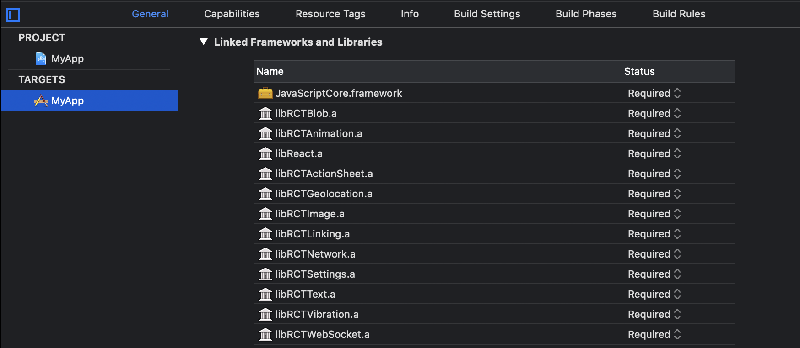

删除 Libraries 文件夹

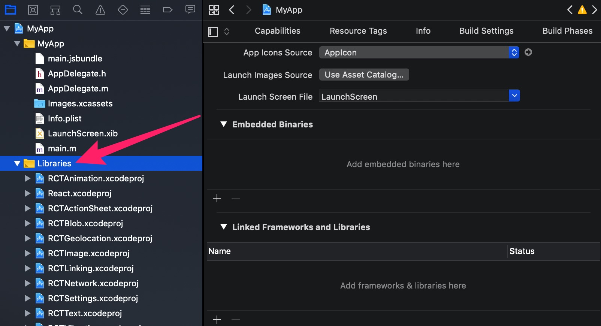

在弹出的确认对话框中，选择 **Move To Trash**

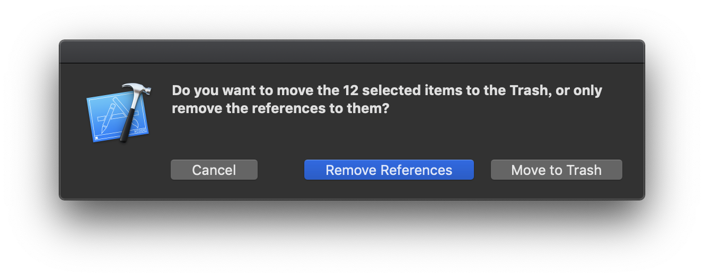

cd 到 ios 文件夹，通过以下命令，创建 Podfile 文件

```
pod init
```

可以看到 ios 文件夹里生成了个 Podfile 文件，打开它，进行编辑

```ruby
# Uncomment the next line to define a global platform for your project
platform :ios, '9.0'
inhibit_all_warnings!

target 'MyApp' do

  node_modules_path = '../node_modules/'

  # RN
  pod 'React', :path => node_modules_path + 'react-native', :subspecs => [
  'Core',
  'CxxBridge',
  'DevSupport', # Include this to enable In-App Devmenu if RN >= 0.43
  'RCTAnimation',
  'RCTActionSheet',
  'RCTText',
  'RCTImage',
  'RCTSettings',
  'RCTCameraRoll',
  'RCTVibration',
  'RCTNetwork',
  'RCTLinkingIOS',
  'RCTWebSocket', # needed for debugging
  # Add any other subspecs you want to use in your project
  ]
  # Explicitly include Yoga if you are using RN >= 0.42.0
  pod 'yoga', :path => node_modules_path +  'react-native/ReactCommon/yoga'
  pod 'DoubleConversion', :podspec => node_modules_path + 'react-native/third-party-podspecs/DoubleConversion.podspec'
  pod 'glog', :podspec => node_modules_path + 'react-native/third-party-podspecs/glog.podspec'
  pod 'Folly', :podspec => node_modules_path + 'react-native/third-party-podspecs/Folly.podspec'

end
```

编辑完成后执行

```
pod install
```

安装完成后，根据提示，关闭项目，然后使用 MyApp.xcworkspace 重新打开项目

务必记住两点：

1. 使用 CocoaPods 生成的 .xcworkspace 文件来打开工程，而不是以前的 .xcodeproj 文件。
2. 每次更改了 Podfile 文件，需要重新执行一次 pod install 命令。

## 初始化 fastlane

该文档编写时，fastlane 的版本是 2.120.0

[fastlane](https://docs.fastlane.tools/) 是 iOS 非常便捷的签名打包工具。

通过以下命令初始化 fastlane

```
cd ios
fastlane init
```

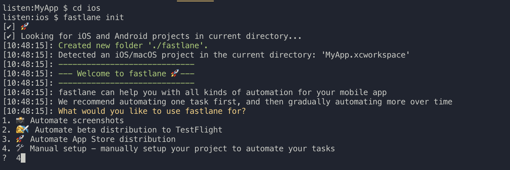

选择 4 ，我们通过手动的方式来配置

初始化完成后，可以看到 ios 文件夹下生成了一个名为 fastlane 的文件夹，里面有 Appfile 和 Fastfile 两个文件

删除 Appfile 文件，因为保密需要，我们不会使用它。

## 用 fastlane 来解决签名问题

fastlane 提供了一些 action 来帮组我们解决代码签名问题，其中最著名的是 [match](https://docs.fastlane.tools/actions/match/)。

打开 Xcode，反勾选 "Automatically manage signing"，我们将使用手动签名的方式：

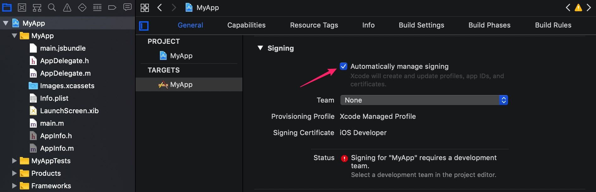

如果是旧项目，先删除原有 profile 文件

打开 Finder，前往文件夹（shift + command + G） ~/Library/MobileDevice/Provisioning Profiles，删除里面的文件。

运行以下命令，初始化 match

```
cd ios
fastlane match init
```

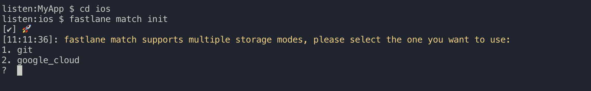

选择 git

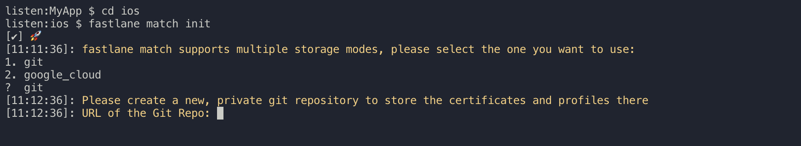

我们在公司的 GitLab 服务器 ios 分组下创建了一个名为 certificates 的仓库：

`git@git.xxxxxx.com:ios/certificates.git`

多个项目可以共享一个证书仓库，只要这些项目的 Bundle ID 不一样即可。

把该仓库地址，作为参数传递给 URL of the Git Repo。

初始化完成后，match 会在 fastlane 文件夹下创建一个叫 Matchfile 的文件。

同样出于保密的需要，我们删除 Matchfile 文件。

运行以下命令，创建并下载开发证书

```
fastlane match development --git_url 'git@git.xxxxxx.com:ios/certificates.git' --app_identifier 'com.shundaojia.myapp' --username 'xxxxxx@gmail.com'
```

其中 username 就是那个未开启二步验证的 Apple ID。

其他同事更新此项目时，也需要执行一次 `fastlane match` 命令，以便把开发证书下载到他的电脑。如果管理者已经通过 `fastlane match` 生成证书，那么开发者可以通过 --username 参数指定他自己的 Apple ID 来下载证书即可，前提是他的 Apple ID 已经添加到公司苹果开发者账号的用户组，并赋予了开发者权限。

```
fastlane match development --git_url 'git@git.xxxxxx.com:ios/certificates.git' --app_identifier 'com.shundaojia.myapp' --username 'someone@gmail.com' --readonly
```

如果不曾在 App Store 创建过该 bundle ID，那么会看到以下错误提示

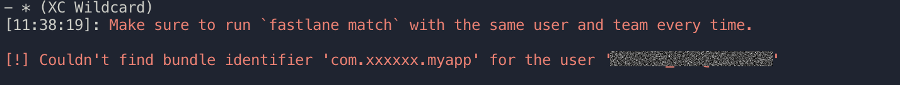

登录[苹果开发者官网](https://developer.apple.com/account)

进入 **Certificates, IDs & Profiles**

点击 **Identifiers/App IDs**

点击 **+** 号，注册 App ID

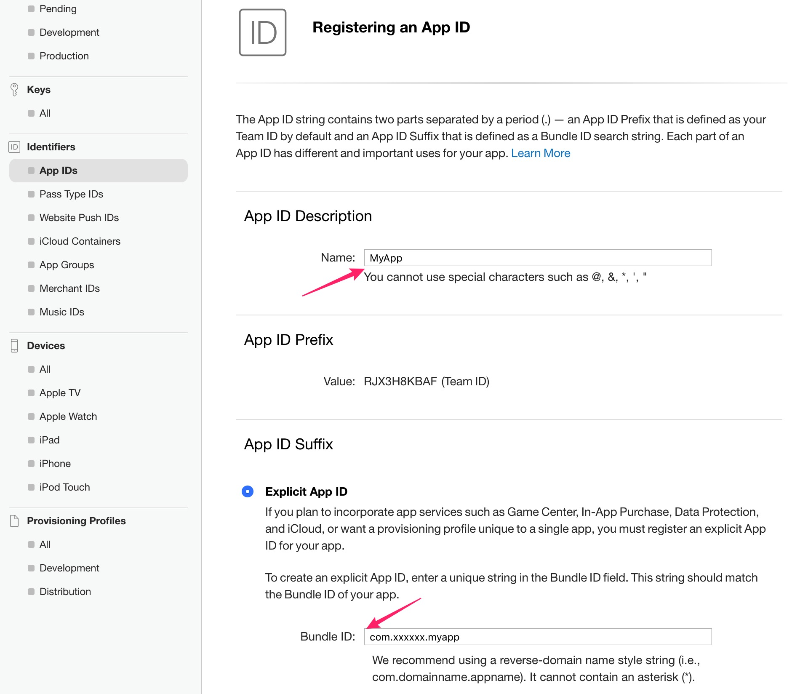

现在再来试试

```
fastlane match development --git_url 'git@git.xxxxxx.com:ios/certificates.git' --app_identifier 'com.shundaojia.myapp' --username 'xxxxxx@gmail.com'
```

可能需要你输入一个密码来对证书进行加密和解密，请记住这个密码，这个密码和环境变量 `MATCH_PASSWORD` 关联。

一切顺利的话，可以看到以下提示

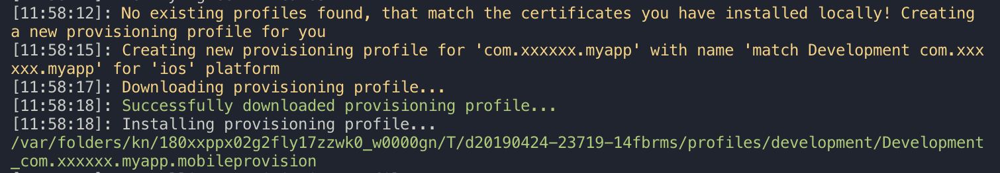

打开 Xcode，配置好 Provisioning Profile，因为我们有 qa 和 production 两个环境，每个环境有 debug 和 release 两个 Configuration，所以我们有 4 处签名需要配置。

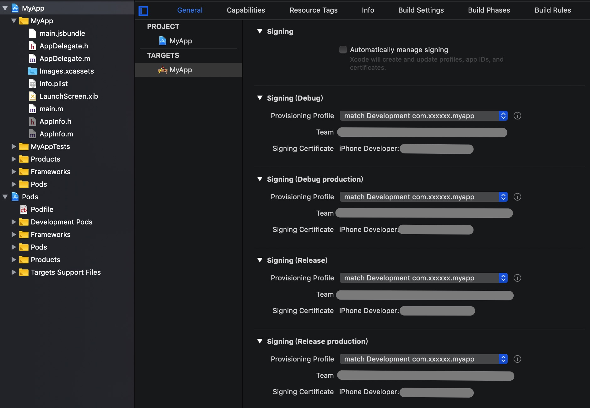

就这样，我们把开发证书这事交给了 match 来管理。

### 可能会遇到的问题

如果之前曾经使用其它账号，而不是 xxxxxx@gmail.com 这个 Apple ID 注册过证书的话，可能会出现问题

此时，我们需要使用

```
fastlane match nuke development
fastlane match nuke distribution
fastlane match nuke enterprise
```

revoke 掉所有的证书 和 provisioning profiles

> 该操作不会影响 AppStore 上已经发布的版本，但依然可能会影响到你的同事，他需要把他本地的证书和 provisioning profiles 也清空，当然，跑 CI 的机器也需要如此操作。

> 清空方法：打开 Finder，前往文件夹（shift + command + G） ~/Library/MobileDevice/Provisioning Profiles，删除里面的文件。
> 证书在钥匙串里，无效的也删了吧

## 使用 fastlane 来打包

我们用 [gym](https://docs.fastlane.tools/actions/gym/) 这个 action 来打包

编辑 ios/fastlane/Fastfile 文件，创建一个名为 build 的 lane

```ruby
app_identifier = ENV['APPLICATION_ID'] || 'com.shundaojia.myapp'
app_name = ENV['APP_NAME'] || 'MyApp'
xcodeproj = "./#{app_name}.xcodeproj"

lane :build do |options|
    ENV['CI'] = 'true' # 确保是在 CI 环境，否则 xcode 中的脚本不会生效
    sh(%(cd #{ENV['PWD']} && rm -rf ./Pods && rm -rf ./Podfile.lock))
    cocoapods(podfile: "./Podfile")

    # 默认打 qa 环境的包
    environment = options[:environment] || ENV['ENVIRONMENT']|| 'qa'
    export_method = options[:export_method] || 'app-store'
    # 如果使用了 Bugly 这类内测分发服务，使用下面这行代码代替上面这行代码
    # export_method = options[:export_method] || (environment == 'production' ? 'app-store' : 'development')
    type = export_method.gsub(/-/, '')

    # 设置 bundle id
    update_app_identifier(
        xcodeproj: xcodeproj,
        plist_path: "#{app_name}/Info.plist",
        app_identifier: app_identifier
    )

    build_number = ENV['VERSION_CODE'] || '1'
    version_name = ENV['VERSION_NAME'] || '1.0.0'

    # 设置 version code
    increment_build_number(
        build_number: build_number,
        xcodeproj: xcodeproj
    )

    # 设置 version name
    increment_version_number(
        version_number: version_name,
        xcodeproj: xcodeproj
    )

    git_url = options[:git_url] || ENV['CERTIFICATES_GIT_URL']
    username = options[:apple_id] || ENV['FASTLANE_USER']

    match(
        type: 'development',
        readonly: true,
        app_identifier: app_identifier,
        git_url: git_url,
        username: username
    )
    match(
        type: type,
        readonly: true,
        app_identifier: app_identifier,
        git_url: git_url,
        username: username
    )

    profile_name = ENV["sigh_#{app_identifier}#{type}_profile-name"];
    output_name = "#{environment}-#{version_name}-#{build_number}"
    # 要求项目 scheme 的命名规则是 app 名称 + 空格 + 环境
    scheme = options[:scheme] || "#{app_name} #{environment}"

    sh(%(cd #{ENV['PWD']} && rm -rf ./build && mkdir build))
    gym(
        export_method: export_method,
        export_options: {
            method: export_method,
            provisioningProfiles: {
                app_identifier => profile_name,
            }
        },
        include_symbols: true,
        include_bitcode: false,
        xcargs: 'DEBUG_INFORMATION_FORMAT="dwarf-with-dsym"',
        scheme: scheme,
        output_name: output_name,
        clean: true,
        output_directory: "./build"
    )
end
```

因为我们在脚本中用到了 cocoapods，编辑 ios 目录下的 Gemfile 文件，添加 cocoapods 依赖，如下

```ruby
source "https://rubygems.org"

gem "fastlane"
gem 'cocoapods'
```

现在，我们来运行 fastlane build

```
bundle exec fastlane build git_url:'git@git.xxxxxx.com:ios/certificates.git' apple_id:'xxxxxx@gmail.com'
```

运行成功后，我们发现，在 ios/build 目录下，本次构建的制品(artifacts)：ipa 包以及 dSYM 符号表。

## 使用 fastlane 来发布 ipa 包

我们将使用苹果官方的内测服务 [TestFlight](https://developer.apple.com/testflight/)，当然，也可以选用国内的内测分发平台。

fastlane 提供了一个叫 [pilot](https://docs.fastlane.tools/actions/testflight/) 的 action 来帮组我们把 ipa 包上传到 App Store Connect。

我们在 Fastfile 中添加一个新的 lane

```ruby
lane :upload_ipa_to_testflight do |options|
    file_name, basename, version_name, build_number, dir_name = app_info
    username = options[:apple_id] || ENV['FASTLANE_USER']
    pilot(
        username: username,
        app_identifier: app_identifier,
        ipa: file_name,
        # changelog 不能过短，否则会有警告
        changelog: 'This is my changelog of things that have changed in a log.',
    )
end

def app_info
  dir_name = "#{ENV['PWD']}/build/*"
  match_extension = '.ipa'
  files = Dir[dir_name]
  file_name = files.find do |file|
    File.extname(file) == match_extension
  end

  basename = File.basename(file_name, match_extension)
  version_name, build_number = basename.split('-').last(2)

  return file_name, basename, version_name, build_number, dir_name
end
```

在执行 `bundle exec fastlane upload_ipa_to_testflight` 之前，先让我们来做些准备工作

1. 前往 App Store Connect 创建 App

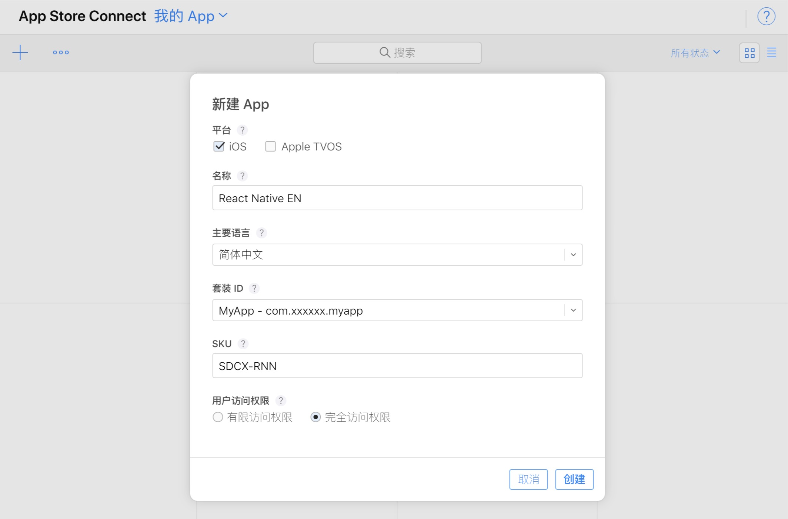

2. 打开 Xcode，添加 AppIcon，本项目附送了一套 icon，可供测试使用

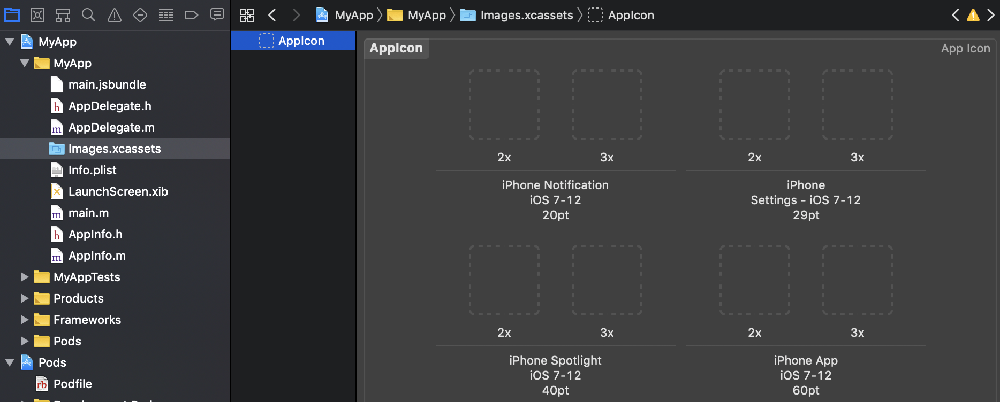

3. 以源码方式打开 Info.plist 文件

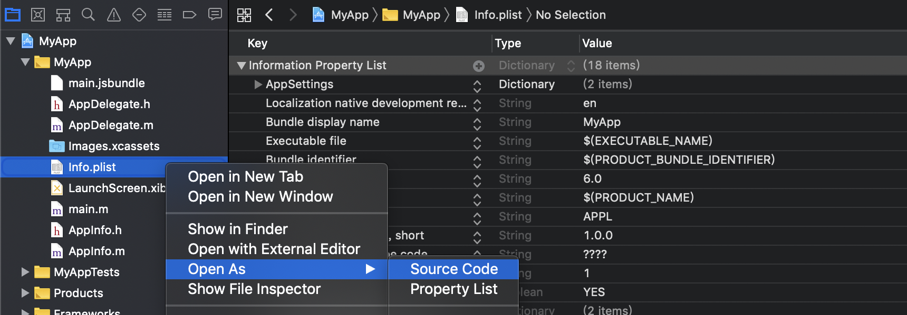

添加使用相册的请求描述

```xml
<key>NSPhotoLibraryUsageDescription</key>
<string>MyApp 需要访问相册来分享图片</string>
```

留意，通过 typescript 模版创建的项目，还请求了定位权限，但描述字符串为空，这同样是无法通过审核的

```xml
<key>NSLocationWhenInUseUsageDescription</key>
<string></string>
```

如果没使用到定位功能，删掉即可，否则像使用相册那样完善描述，在本示例中，我们选择了删除。

重新打个包再上传

```
bundle exec fastlane build git_url:'git@git.xxxxxx.com:ios/certificates.git' apple_id:'xxxxxx@gmail.com'
bundle exec fastlane upload_ipa_to_testflight apple_id:'xxxxxx@gmail.com'
```

如果出现以下消息，说明 ipa 包未能通过检测，按下 **Control + C**，留意苹果给你发的邮件

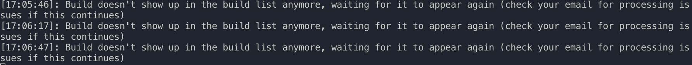

ipa 包通过检测后，TestFlight 功能将被激活，前往 App Store Connenct, 打开我的 App 页面，选择 TestFlight 选项卡，可以看到

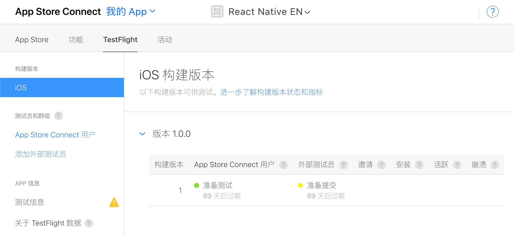

选择侧边栏的 App Store Connect 用户，点击测试员旁边的 + 按钮，添加内部测试员。内部测试员必须是开发组的成员。

添加成功后，测试员会收到邮件邀请

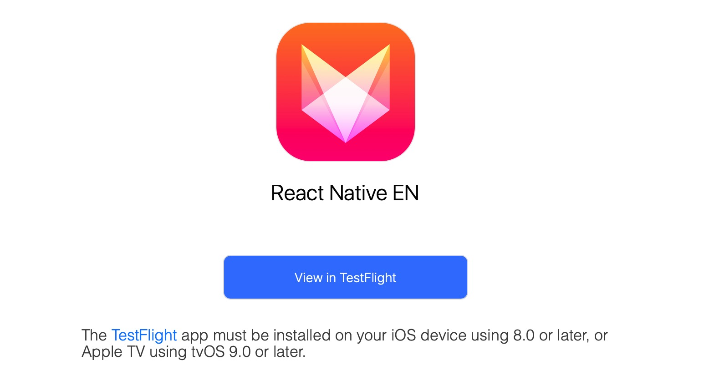

测试员接受邀请，在 App Store 下载 TestFlight App，输入兑换码，即可安装 App 进行测试，以后每次发布新包，测试员都可以收到通知。

使用 TestFlight 还有一个好处，可以直接把通过测试的包发布到 AppStore，如果使用其它测试分发平台，还需要再次打包。

### 可能会遇到的问题

如果发现如下错误

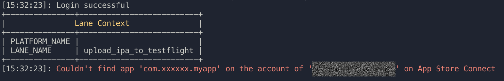

说明准备工作 1 没做好

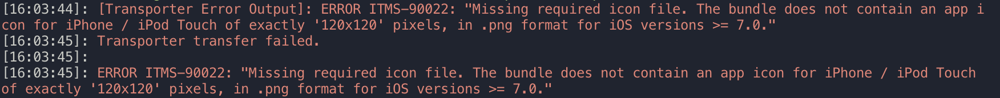

说明准备工作 2 没做好

如果收到这样的邮件

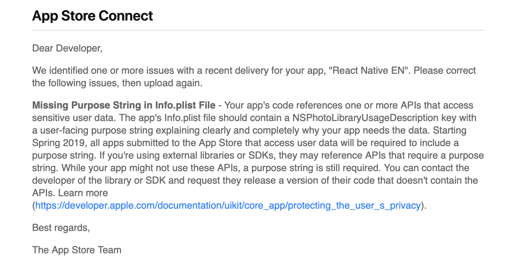

说明 ipa 未能通过检测，请根据提示修复问题

## 使用 fastlane 上传测试包到 Bugly

本来写完 TestFlight，本文就应该结束了，奈何发布到 TestFlight 上的包，无法用肉眼分辨哪些是生产环境的，哪些是测试环境的。

我们只好改变策略，使用 TestFlight 来分发生产环境的包，使用 Bugly 来分发测试环境的包。

当然也可以使用蒲公英或其它分发平台，那为什么我们不用呢，因为之前的同事用的就是 Bugly，关于蒲公英如何与 fastlane 集成，读者可以参考[这篇文章](https://www.pgyer.com/doc/view/fastlane)。

为什么不也用 Bugly 来分发生产环境的包呢？因为 TestFlight 上的包通过测试后，是可以直接发布到 App Store 的，如果使用 Bugly 的话，还需要再次打包上传到 App Store Connect。

> 一个不幸的消息是，Bugly 已经不再对新应用提供内测分发服务。

> 一个好消息是，因此，我不用讲怎么申请 Bugly 内测分发服务了。

让我们在 Fastfile 中添加一个新的 lane

```ruby
lane :upload_ipa_to_bugly do |options|
    file_name, basename = app_info
    bugly_exp_id = options[:bugly_exp_id] || ENV['BUGLY_EXP_ID']
    bugly_app_key = options[:bugly_app_key] || ENV['BUGLY_APP_KEY']
    command = %(cd #{ENV['PWD']} && \
        curl --insecure -X "PUT" \
        -F "file=@#{file_name}" \
        -F "exp_id=#{bugly_exp_id}" \
        https://api.bugly.qq.com/beta/apiv1/exp?app_key=#{bugly_app_key})
    sh(command)
end
```

就这样
