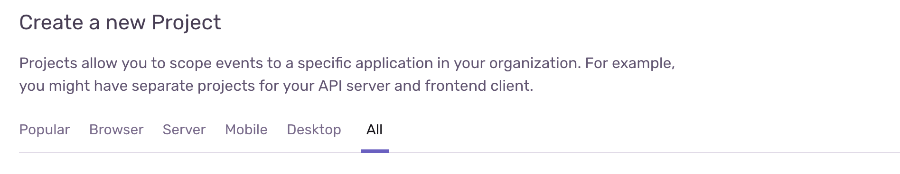
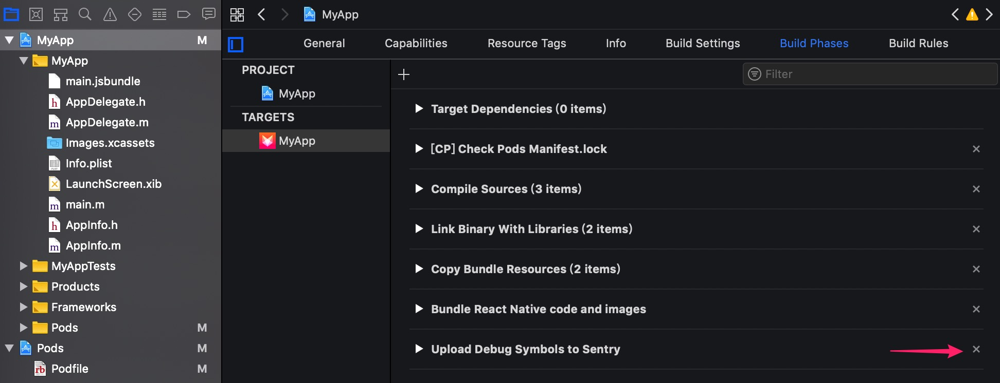
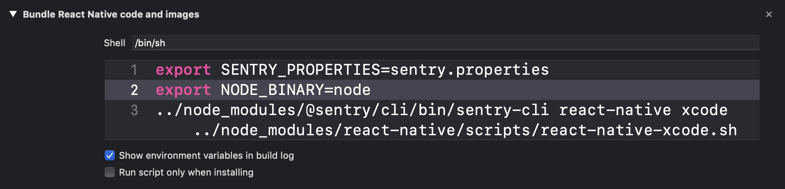
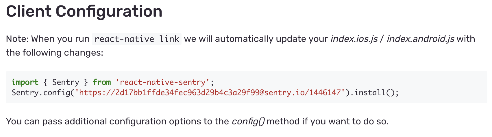
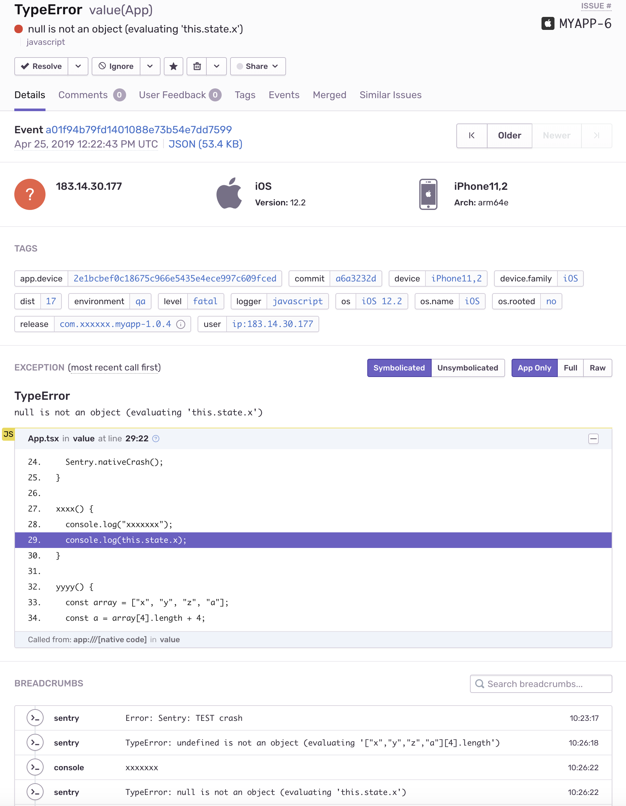

Sentry 是一款开源的错误跟踪，可帮助开发人员实时监控和修复崩溃的工具。最重要的是，它同时支持对原生代码和 React Native 代码的错误跟踪。

本文讲述如何将 [Sentry](https://sentry.io/welcome/) 和 **CI / CD** 集成。

- 在打包时注入 Commit SHA，帮助我们还原出问题的代码
- 上传符号表（RN - jsbundle.map, iOS - dSYM, Android - mapping.txt）

> 请注意，本文档编写时，使用的 RN 版本是 0.59

## 安装 sentry-cli

```
npm install -g @sentry/cli@1.41.0
```

注意我们所使用的 sentry-cli 的版本

## 登录和创建 Sentry Project

登录（省略一百个字）

创建 Sentry Project

1. 打开 All 选项卡，选择 **React-Native**



2. 更改项目名, 并点击 **Create Projec**


3. 安装

```
yarn add react-native-sentry

react-native link react-native-sentry
```

## 调整 iOS 项目

```
cd ios
pod install
```

- 将 AppDelegate.m 文件还原成 `react-native link react-native-sentry` 执行前的样子

- 删除 **Upload Debug Symbols to Sentry** 这个 Build Phase



- 展开 **Bundle React Native code and images** 这个 Build Phase，将里面的脚本替换成如下内容



```shell
if [ -z "$CI" ]; then
export NODE_BINARY=node
../node_modules/react-native/scripts/react-native-xcode.sh
else
export NODE_BINARY=node
sourcemap_path="$SRCROOT/build/main.jsbundle.map"
sourcemap_sources_root="$SRCROOT/../"
export EXTRA_PACKAGER_ARGS="--sourcemap-output $sourcemap_path --sourcemap-sources-root $sourcemap_sources_root"
echo $EXTRA_PACKAGER_ARGS >&2
../node_modules/react-native/scripts/react-native-xcode.sh

bundle_path="$CONFIGURATION_BUILD_DIR/$UNLOCALIZED_RESOURCES_FOLDER_PATH/main.jsbundle"
build_dir="$SRCROOT/build"
if [ -e "$bundle_path" ]; then
cp "$bundle_path" "$build_dir"
else
echo "可能 ts 代码有错误，无法通过编译。"
exit 3
fi
fi
```

- 修改 ios/fastlane/Fastfile 文件，添加一个 lane

```ruby
lane :upload_debug_symbol_to_sentry do |options|

  file_name, basename, version_name, build_number, dir_name = app_info

  bundle_output = "#{ENV['PWD']}/build/main.jsbundle"
  sourcemap_output = "#{ENV['PWD']}/build/main.jsbundle.map"
  release = "#{app_identifier}-#{version_name}"

  sh(%(
      sentry-cli --log-level INFO releases new #{release}
  ))

  # upload_sourcemaps
  sh(%(
      sentry-cli --log-level INFO releases files #{release} upload-sourcemaps --dist #{build_number} --rewrite #{sourcemap_output}
  ))

  # upload_bundle
  sh(%(
      sentry-cli --log-level INFO releases files #{release} upload --dist #{build_number} #{bundle_output} "~/main.jsbundle"
  ))

  sh(%(sentry-cli releases finalize #{release}))

  # upload_sdym
  sh(%(
      sentry-cli --log-level INFO upload-dif -t dsym --no-bin #{dir_name}
  ))
end
```

## 调整 Android 项目

- 创建 android/app/react.gradle 文件，内容如下，该文件是对 node_modules/react-native/react.gradle 文件的拷贝和修改。

```groovy
import org.apache.tools.ant.taskdefs.condition.Os

def config = project.hasProperty("react") ? project.react : [];

def cliPath = config.cliPath ?: "node_modules/react-native/cli.js"
def bundleAssetName = config.bundleAssetName ?: "index.android.bundle"
def entryFile = config.entryFile ?: "index.android.js"
def bundleCommand = config.bundleCommand ?: "bundle"
def reactRoot = file(config.root ?: "../../")
def inputExcludes = config.inputExcludes ?: ["android/**", "ios/**"]
def bundleConfig = config.bundleConfig ? "${reactRoot}/${config.bundleConfig}" : null;


afterEvaluate {
    def isAndroidLibrary = plugins.hasPlugin("com.android.library")
    def variants = isAndroidLibrary ? android.libraryVariants : android.applicationVariants
    variants.all { def variant ->
        // Create variant and target names
        def targetName = variant.name.capitalize()
        def targetPath = variant.dirName

        // React js bundle directories
        def jsBundleDir = file("$buildDir/generated/assets/react/${targetPath}")
        def resourcesDir = file("$buildDir/generated/res/react/${targetPath}")

        def jsBundleFile = file("$jsBundleDir/$bundleAssetName")
        def jsBundleMapFile = file("$jsBundleDir/${bundleAssetName}.map")

        // Additional node and packager commandline arguments
        def nodeExecutableAndArgs = config.nodeExecutableAndArgs ?: ["node"]
        def extraPackagerArgs = config.extraPackagerArgs ?: []

        def currentBundleTask = tasks.create(
                name: "bundle${targetName}JsAndAssets",
                type: Exec) {
            group = "react"
            description = "bundle JS and assets for ${targetName}."

            // Create dirs if they are not there (e.g. the "clean" task just ran)
            doFirst {
                jsBundleDir.deleteDir()
                jsBundleDir.mkdirs()
                resourcesDir.deleteDir()
                resourcesDir.mkdirs()
            }

            // Set up inputs and outputs so gradle can cache the result
            inputs.files fileTree(dir: reactRoot, excludes: inputExcludes)
            outputs.dir(jsBundleDir)
            outputs.dir(resourcesDir)

            // Set up the call to the react-native cli
            workingDir(reactRoot)

            // Set up dev mode
            def devEnabled = !(config."devDisabledIn${targetName}"
                    || targetName.toLowerCase().contains("release"))

            def extraArgs = extraPackagerArgs;

            if (bundleConfig) {
                extraArgs = extraArgs.clone()
                extraArgs.add("--config");
                extraArgs.add(bundleConfig);
            }

            if (Os.isFamily(Os.FAMILY_WINDOWS)) {
                commandLine("cmd", "/c", *nodeExecutableAndArgs, cliPath, bundleCommand, "--platform", "android", "--dev", "${devEnabled}",
                        "--reset-cache", "--entry-file", entryFile, "--bundle-output", jsBundleFile, "--assets-dest", resourcesDir, *extraArgs)
            } else {
                commandLine(*nodeExecutableAndArgs, cliPath, bundleCommand, "--platform", "android", "--dev", "${devEnabled}",
                        "--reset-cache", "--entry-file", entryFile, "--bundle-output", jsBundleFile, "--sourcemap-output", jsBundleMapFile, "--sourcemap-sources-root", reactRoot, "--assets-dest", resourcesDir, *extraArgs)
            }

            enabled config."bundleIn${targetName}" ||
                    config."bundleIn${variant.buildType.name.capitalize()}" ?:
                    targetName.toLowerCase().contains("release")
        }

        // Expose a minimal interface on the application variant and the task itself:
        variant.ext.bundleJsAndAssets = currentBundleTask
        currentBundleTask.ext.generatedResFolders = files(resourcesDir).builtBy(currentBundleTask)
        currentBundleTask.ext.generatedAssetsFolders = files(jsBundleDir).builtBy(currentBundleTask)

        // registerGeneratedResFolders for Android plugin 3.x
        if (variant.respondsTo("registerGeneratedResFolders")) {
            variant.registerGeneratedResFolders(currentBundleTask.generatedResFolders)
        } else {
            variant.registerResGeneratingTask(currentBundleTask)
        }
        variant.mergeResourcesProvider.get().dependsOn(currentBundleTask)

        // packageApplication for Android plugin 3.x
        def packageTask = variant.hasProperty("packageApplication") ? variant.packageApplicationProvider.get() : tasks.findByName("package${targetName}")
        if (variant.hasProperty("packageLibrary")) {
            packageTask = variant.packageLibrary
        }

        // pre bundle build task for Android plugin 3.2+
        def buildPreBundleTask = tasks.findByName("build${targetName}PreBundle")


        def resourcesDirConfigValue = config."resourcesDir${targetName}"
        if (resourcesDirConfigValue) {
            def currentCopyResTask = tasks.create(
                    name: "copy${targetName}BundledResources",
                    type: Copy) {
                group = "react"
                description = "copy bundled resources into custom location for ${targetName}."

                from(resourcesDir)
                into(file(resourcesDirConfigValue))

                dependsOn(currentBundleTask)

                enabled(currentBundleTask.enabled)
            }

            packageTask.dependsOn(currentCopyResTask)
            if (buildPreBundleTask != null) {
                buildPreBundleTask.dependsOn(currentCopyResTask)
            }
        }

        def currentAssetsCopyTask = tasks.create(
                name: "copy${targetName}BundledJs",
                type: Copy) {
            group = "react"
            description = "copy bundled JS into ${targetName}."

            if (config."jsBundleDir${targetName}") {
                from(jsBundleDir)
                into(file(config."jsBundleDir${targetName}"))
            } else {
                into("$buildDir/intermediates")
                into("assets/${targetPath}") {
                    from(jsBundleFile)
                }

                // Workaround for Android Gradle Plugin 3.2+ new asset directory
                into("merged_assets/${variant.name}/merge${targetName}Assets/out") {
                    from(jsBundleFile)
                }
            }

            // mergeAssets must run first, as it clears the intermediates directory
            dependsOn(variant.mergeAssetsProvider.get())

            enabled(currentBundleTask.enabled)
        }

        packageTask.dependsOn(currentAssetsCopyTask)
        if (buildPreBundleTask != null) {
            buildPreBundleTask.dependsOn(currentAssetsCopyTask)
        }
    }
}
```

- 创建 android/app/sentry.gradle 文件，内容如下

```groovy
import org.apache.tools.ant.taskdefs.condition.Os

def config = project.hasProperty("sentryCli") ? project.sentryCli : []
def reactRoot = file(config.root ?: "../../")

afterEvaluate {

    android.applicationVariants.all { variant ->

        def targetName = variant.name.capitalize()

        def flavor = variant.flavorName

        def proguardTask = tasks.findByName("transformClassesAndResourcesWithProguardFor${targetName}")
        if (proguardTask == null) {
            return
        }
        def dexTask = tasks.findByName("transformClassesWithDexBuilderFor${targetName}")
        if (dexTask == null) {
            return
        }

        def propertiesFile = "$rootDir/sentry.properties"
        if (new File("$rootDir/sentry-$flavor" + ".properties").exists()) {
            propertiesFile = "$rootDir/sentry-$flavor" + ".properties"
            println "For $variant.name using: $propertiesFile"
        }

        Properties sentryProps = new Properties()
        try {
            sentryProps.load(new FileInputStream(propertiesFile))
        } catch (FileNotFoundException e) {
            println "File not found: $propertiesFile"
        }

        def cliExecutable = sentryProps.get("cli.executable", "$reactRoot/node_modules/@sentry/cli/bin/sentry-cli")

        // https://docs.sentry.io/cli/dif/proguard/
        // https://docs.sentry.io/clients/java/modules/android/
        // https://github.com/getsentry/sentry-java/issues/528
        // https://github.com/getsentry/sentry-java/blob/master/sentry-android-gradle-plugin/src/main/groovy/io/sentry/android/gradle/SentryPlugin.groovy

        def persistIdsTask = tasks.create(
                name: "processSentryProGuardFor${targetName}",
                type: Exec) {

            if (!System.getenv("CI")) {
                if (Os.isFamily(Os.FAMILY_WINDOWS)) {
                    commandLine("cmd", "/c", "echo", "skip processing proGuard for sentry.")
                } else {
                    commandLine("echo", "skip processing proGuard for sentry.")
                }
                return
            }

            workingDir reactRoot

            def args = [
                    cliExecutable
            ]
            if (config.logLevel) {
                args.push("--log-level")
                args.push(config.logLevel)
            }

            args.push("upload-proguard")
            args.push("--android-manifest")
            args.push("$buildDir/intermediates/merged_manifests/${variant.name}/armeabi-v7a/AndroidManifest.xml")
            args.push("--write-properties")
            args.push("${variant.mergeAssetsProvider.get().outputDir}/sentry-debug-meta.properties")
            args.push(variant.mappingFile)
            args.push("--no-upload")

            println args

            if (Os.isFamily(Os.FAMILY_WINDOWS)) {
                commandLine("cmd", "/c", *args)
            } else {
                commandLine(*args)
            }
            enabled true
        }

        if (proguardTask && dexTask) {
            dexTask.dependsOn persistIdsTask
            persistIdsTask.dependsOn proguardTask
        }
    }
}
```

- 修改 anroid/app/build.gradle 文件

```diff
- apply from: "../../node_modules/react-native/react.gradle"
- apply from: "../../node_modules/react-native-sentry/sentry.gradle"
+ apply from: "./react.gradle"
+ apply from: "./sentry.gradle"
```

## 调整 js 代码

- 修改 index.js 文件

Sentry 项目创建成功后，会打开一个安装引导页面，将该页面拖到底部，拷贝如下代码到你的 index.js 文件中



```js
// index.js
import { AppRegistry } from 'react-native'
import App from './App'
import { name as appName, commit } from './app.json'
import { ENVIRONMENT, BUILD_TYPE, BUILD_TYPE_RELEASE } from './app/AppInfo'
import { Sentry } from 'react-native-sentry'

if (BUILD_TYPE === BUILD_TYPE_RELEASE) {
  Sentry.config('https://2d17bb1ffde34fec963d29b4c3a29f99@sentry.io/1446147').install()
  Sentry.setTagsContext({
    environment: ENVIRONMENT,
    commit: commit,
  })
}

AppRegistry.registerComponent(appName, () => App)
```

- 修改 App.tsx 文件，添加一些能导致崩溃的代码

```tsx
// App.tsx
import React, { Component } from 'react'
import { StyleSheet, Text, View, TouchableOpacity, Image } from 'react-native'
import { Sentry } from 'react-native-sentry'
import { ENVIRONMENT, VERSION_NAME, VERSION_CODE } from './app/AppInfo'

interface Props {}
interface State {
  x: string
}
export default class App extends Component<Props, State> {
  constructor(props: Props) {
    super(props)
    this.sentryCrash = this.sentryCrash.bind(this)
    this.sentryNativeCrash = this.sentryNativeCrash.bind(this)
    this.xxxx = this.xxxx.bind(this)
    this.yyyy = this.yyyy.bind(this)
  }

  sentryCrash() {
    Sentry.crash()
  }

  sentryNativeCrash() {
    Sentry.nativeCrash()
  }

  xxxx() {
    console.log('xxxxxxx')
    console.log(this.state.x)
  }

  yyyy() {
    const array = ['x', 'y', 'z', 'a']
    const a = array[4].length + 4
    console.log(`${Number(a) + 1}`)
  }

  capture() {
    Sentry.captureException(new Error('XXXXXXXX'), {
      logger: 'my.module',
    })
  }

  render() {
    return (
      <View style={[styles.container]}>
        <Text style={styles.welcome}>
          环境: {`${ENVIRONMENT}`} 版本: {`${VERSION_NAME} - ${VERSION_CODE}`}
        </Text>
        <Text style={styles.welcome}>按下一个按钮，让 APP 崩溃! --</Text>

        <TouchableOpacity onPress={this.sentryCrash} activeOpacity={0.2} style={styles.button}>
          <Text style={styles.buttonText}>Sentry crash</Text>
        </TouchableOpacity>

        <TouchableOpacity onPress={this.sentryNativeCrash} activeOpacity={0.2} style={styles.button}>
          <Text style={styles.buttonText}>Sentry native crash</Text>
        </TouchableOpacity>

        <TouchableOpacity onPress={this.xxxx} activeOpacity={0.2} style={styles.button}>
          <Text style={styles.buttonText}>xxxx</Text>
        </TouchableOpacity>

        <TouchableOpacity onPress={this.yyyy} activeOpacity={0.2} style={styles.button}>
          <Text style={styles.buttonText}>yyyy</Text>
        </TouchableOpacity>

        <TouchableOpacity onPress={this.capture} activeOpacity={0.2} style={styles.button}>
          <Text style={styles.buttonText}>capture</Text>
        </TouchableOpacity>
      </View>
    )
  }
}

const styles = StyleSheet.create({
  container: {
    flex: 1,
    justifyContent: 'flex-start',
    alignItems: 'stretch',
    paddingTop: 16,
  },
  welcome: {
    backgroundColor: 'transparent',
    fontSize: 17,
    textAlign: 'center',
    margin: 8,
  },
  button: {
    alignItems: 'center',
    justifyContent: 'center',
    height: 40,
  },

  buttonText: {
    backgroundColor: 'transparent',
    color: 'rgb(34,88,220)',
  },
})
```

## 修改 CI 脚本

- 注入 Commit SHA

在 ci 文件夹中添加 sha.js 文件

```js
// sha.js
const fs = require('fs')
const path = require('path')

const file = path.resolve(__dirname, '../app.json')
const data = fs.readFileSync(file, 'utf8')
const app = JSON.parse(data)
app.commit = (process.env.CI_COMMIT_SHA || 'xxxxxxxx').substr(0, 8)
fs.writeFileSync(file, JSON.stringify(app))
```

- 修改 ci/config.js 文件，添加若干常量

```js
// config.js
// Android js bundle 原始目录
const JS_BUNDLE_SOURCE_DIR = path.resolve(BUILD_DIR, `generated/assets/react/${ENVIRONMENT}/release/`)

// AndroidManifest.xml
const MANIFEST_FILENAME = 'AndroidManifest.xml'
// AndroidManifest.xml 原始路径
const MANIFEST_SOURCE_PATH = path.resolve(
  BUILD_DIR,
  `intermediates/merged_manifests/${ENVIRONMENT}Release/armeabi-v7a/${MANIFEST_FILENAME}`,
  // 不同 gradle 版本，这个值是不一样的，如果 gralde 版本是 3.1.4，使用下面这个配置
  //`intermediates/merged_manifests/${ENVIRONMENT}Release/armeabi-v7a/${MANIFEST_FILENAME}`
)

// sentry properties 所在路径
const SENTRY_PROPERTIES_PATH = path.resolve(__dirname, `../${PLATFORM}/sentry.properties`)
const SENTRY_DEBUG_META_FILENAME = 'sentry-debug-meta.properties'
// sentry-debug-meta.properties 原始路径
const SENTRY_DEBUG_META_SOURCE_PATH = path.resolve(
  BUILD_DIR,
  `intermediates/merged_assets/${ENVIRONMENT}Release/merge${ENVIRONMENT_CAPITALIZE}ReleaseAssets/out/${SENTRY_DEBUG_META_FILENAME}`,
  // 不同 gradle 版本，这个值是不一样的，如果 gralde 版本是 3.1.4，使用下面这个配置
  // `intermediates/merged_assets/${ENVIRONMENT}Release/merge${ENVIRONMENT_CAPITALIZE}ReleaseAssets/out/${SENTRY_DEBUG_META_FILENAME}`
)

const MAPPING_FILENAME = 'mapping.txt'
// android mapping.txt 原始路径
const MAPPING_FILE_SOURCE_PATH = path.resolve(BUILD_DIR, `outputs/mapping/${ENVIRONMENT}/release/${MAPPING_FILENAME}`)
```

- 修改 ci/build.js 文件，在文件末尾增加如下内容

```js
// ci/build.js
// jsbundle
copy(JS_BUNDLE_SOURCE_DIR, ARTIFACTS_DIR)

// AndroidManifest.xml
fs.copyFileSync(MANIFEST_SOURCE_PATH, path.resolve(ARTIFACTS_DIR, MANIFEST_FILENAME), COPYFILE_EXCL)

// sentry-debug-meta.properties
if (fs.existsSync(SENTRY_DEBUG_META_SOURCE_PATH)) {
  fs.copyFileSync(SENTRY_DEBUG_META_SOURCE_PATH, path.resolve(ARTIFACTS_DIR, SENTRY_DEBUG_META_FILENAME), COPYFILE_EXCL)
}

// mapping.txt
fs.copyFileSync(MAPPING_FILE_SOURCE_PATH, path.resolve(ARTIFACTS_DIR, MAPPING_FILENAME), COPYFILE_EXCL)
```

- 创建 ci/sentry.js 文件

```js
// ci/sentry.js
const path = require('path')
const { sh } = require('./utils')
const {
  APPLICATION_ID,
  PLATFORM,
  VERSION_NAME,
  VERSION_CODE,
  ARTIFACTS_DIR,
  SENTRY_PROPERTIES_PATH,
  MANIFEST_FILENAME,
  MAPPING_FILENAME,
  SENTRY_DEBUG_META_FILENAME,
} = require('./config')

if (PLATFORM === 'ios') {
  // -------------------------------ios-------------------------------------
  const workdir = process.env.IOS_DIR || path.resolve(__dirname, '../ios')
  sh(
    `bundle exec fastlane upload_debug_symbol_to_sentry`,
    { ...process.env, SENTRY_PROPERTIES: SENTRY_PROPERTIES_PATH },
    workdir,
  )
  process.exit(0)
}

// -------------------------------android-------------------------------------
const release = `${APPLICATION_ID}-${VERSION_NAME}`
// 上传 js bundle map 文件
sh(
  `sentry-cli --log-level INFO react-native gradle \
    --bundle ${ARTIFACTS_DIR}/index.android.bundle \
    --sourcemap ${ARTIFACTS_DIR}/index.android.bundle.map \
    --release ${release} \
    --dist ${VERSION_CODE}`,
  { ...process.env, SENTRY_PROPERTIES: SENTRY_PROPERTIES_PATH },
)

// 上传 java 符号表
sh(
  `sentry-cli --log-level INFO upload-proguard \
    --android-manifest ${ARTIFACTS_DIR}/${MANIFEST_FILENAME} \
    --write-properties ${ARTIFACTS_DIR}/${SENTRY_DEBUG_META_FILENAME} ${ARTIFACTS_DIR}/${MAPPING_FILENAME}`,
  { ...process.env, SENTRY_PROPERTIES: SENTRY_PROPERTIES_PATH },
)
```

- 修改 .gitlab-ci.yml 文件，修改两个 job，添加两个 job，这是修改后的样子：

```yml
before_script:
  - export

stages:
  - build
  - deploy

variables:
  LC_ALL: 'en_US.UTF-8'
  LANG: 'en_US.UTF-8'
  APP_MODULE: app

build:ios:
  stage: build
  artifacts:
    paths:
      - ios/build/
  script:
    - yarn install
    - node ./ci/sha.js
    - node ./ci/build.js ios
  tags:
    - ios
  except:
    refs:
      - tags
    variables:
      - $ANDROID_ONLY

deploy:ios:upload:
  stage: deploy
  dependencies:
    - build:ios
  script:
    - node ./ci/upload.js ios
  allow_failure: true
  only:
    - schedules
  tags:
    - ios
  except:
    variables:
      - $ANDROID_ONLY

deploy:ios:sentry:
  stage: deploy
  dependencies:
    - build:ios
  script:
    - node ./ci/sentry.js ios
  allow_failure: true
  only:
    - schedules
  tags:
    - ios
  except:
    variables:
      - $ANDROID_ONLY

build:android:
  stage: build
  script:
    - yarn install
    - node ./ci/sha.js
    - node ./ci/build.js android
  artifacts:
    paths:
      - android/${APP_MODULE}/build/artifacts/
  tags:
    - android
  except:
    refs:
      - tags
    variables:
      - $IOS_ONLY

deploy:android:upload:
  stage: deploy
  dependencies:
    - build:android
  script:
    - node ./ci/upload.js android
  allow_failure: true
  only:
    - schedules
  tags:
    - android
  except:
    variables:
      - $IOS_ONLY

deploy:android:sentry:
  stage: deploy
  dependencies:
    - build:android
  script:
    - node ./ci/sentry.js android
  allow_failure: true
  only:
    - schedules
  tags:
    - android
  except:
    variables:
      - $IOS_ONLY
```

## 测试

至此，我们已经集成了 Sentry，并实现通过 CI 打包时，将会上传符号表到 Sentry，现在就让我们上传代码到 GitLab，点击 Play 按钮打个包来测试一下吧。

一旦发生异常，Sentry 将收到报告，不仅定位到了出错的地方，还附带 Breadcrumbs，即崩溃前的日志。



我们可以在 TAGS 一栏中找到 commit 和 environment，这正是我们通过以下代码所设置的

```js
Sentry.setTagsContext({
  environment: ENVIRONMENT,
  commit: commit,
})
```

environment 可以告诉我们，是哪个环境出了问题，commit 可以告诉我们，是基于那个 commit 打的包出了问题。
